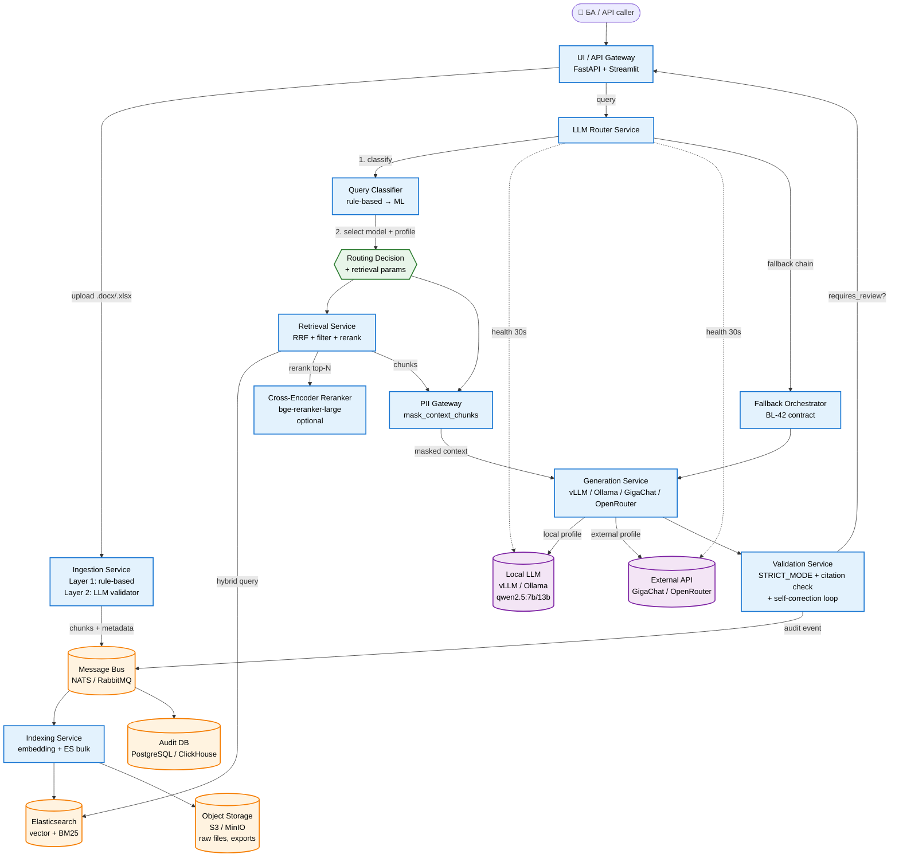

# 🔬 Research: Next-Gen RAG Architecture, Dynamic LLM Routing & Infrastructure Tiers (BL-60)

## Метаданные
- **Дата:** 2026-05-20
- **Версия:** v1
- **Тип документа:** `research` (см. [`docs/standards/naming-convention.md`](../standards/naming-convention.md) v1.1 §3.2)
- **Статус:** Draft → готов к ревью PO / Tech Lead / Infra
- **Автор:** konard (AI issue solver, по [issue #214](https://github.com/G-Ivan-A/clarify-engine-ai/issues/214))
- **Спринт:** Sprint 5 — Pilot Readiness & Advanced Parsing
- **PR:** [`#215`](https://github.com/G-Ivan-A/clarify-engine-ai/pull/215)
- **Линкованный backlog:** новая ветка `BL-60` в [`docs/backlog/2026-05-20_backlog_arm-pilot-test-fixes_v1.md`](../backlog/2026-05-20_backlog_arm-pilot-test-fixes_v1.md)
- **Depends on:** `BL-43` (Smoke Verification — ✅), `BL-57` (UI audit — ✅), `BL-58` (Retrieval Research — ✅, PR #212), `BL-59` (Parsing Research — ✅, PR #211)
- **Целевая аудитория:** Product Owner, Tech Lead, DevOps/Infra Lead, ML-инженер.
- **Связанные документы:**
  - [`docs/CONCEPT.md`](../CONCEPT.md) §3, §4, §5 — концепция MVP, FR/NFR.
  - [`docs/ADR/001-rag-architecture.md`](../ADR/001-rag-architecture.md) — текущая RAG-архитектура (ChromaDB + Hybrid).
  - [`docs/ADR/003-multi-agent-orchestration-draft.md`](../ADR/003-multi-agent-orchestration-draft.md) — драфт оркестрации (контекст для разделения сервисов).
  - [`docs/ADR/004-prompt-management.md`](../ADR/004-prompt-management.md) — управление промптами и версионированием.
  - [`docs/ADR/005-audit-trail.md`](../ADR/005-audit-trail.md) — контракт audit-логирования (раздел §6.5 ниже).
  - [`docs/research/2026-05-21_bl-57_retrieval-architecture_v1.md`](2026-05-21_bl-57_retrieval-architecture_v1.md) — BL-58 retrieval research (query expansion как Pareto-оптимум Sprint 4).
  - [`docs/research/2026-05-20_bl-59_requirement-parsing_v1.md`](2026-05-20_bl-59_requirement-parsing_v1.md) — BL-59 parsing research (двухслойный rule-based + LLM-validator).
  - [`configs/llm_config.yaml`](../../configs/llm_config.yaml), [`configs/embedding_config.yaml`](../../configs/embedding_config.yaml) — текущие контракты, расширяются в Sprint 6+.
  - [`src/rag/retriever.py`](../../src/rag/retriever.py), [`src/llm/client.py`](../../src/llm/client.py), [`src/pipeline.py`](../../src/pipeline.py) — интеграционные точки.

> 🔍 **Scope Note (повтор §10 issue #214).** Это **исследование**, не реализация. Никаких изменений в `src/`, `configs/`, `prompts/` в рамках этого PR. Артефакты — только `docs/research/`, `CHANGELOG.md` и (для воспроизводимости PoC §8) опциональные experiment-стабы в `experiments/` без подключения к продакшну. Все рекомендации требуют отдельных BL-задач после `Accepted` PO/Tech Lead.

---

## 1. Executive Summary

Пилотное тестирование на АРМ ([issue #182](https://github.com/G-Ivan-A/clarify-engine-ai/issues/182)) и retrospective BL-57/58/59 показали: текущая архитектура (Streamlit-монолит + ChromaDB + жёсткая цепочка `GigaChat → OpenRouter → Ollama` + наивный парсинг) спроектирована под демо на одном устройстве, но не масштабируется на (а) пилот с несколькими БА, (б) разные классы запросов (типовая валидация vs креативное обобщение vs PII-sensitive consult), (в) корпоративную инфраструктуру заказчика (Elasticsearch уже развёрнут).

Это исследование закрывает четыре направления:

1. **LLM Routing.** Динамическая маршрутизация между локальной моделью (`qwen2.5:7b` через Ollama / vLLM) и внешними провайдерами (GigaChat, OpenRouter) на основе **classifier-сигналов**: длина и сложность запроса, PII-флаги, SLA latency, health провайдеров, бюджет токенов. Рекомендация — **rule-based router** (порог < 10 мс) на Sprint 6, ML-router (distilbert / Qwen-classifier) на Sprint 7+.
2. **Поисковый слой.** **Elasticsearch 8.x** (`dense_vector` + BM25 + RRF + cross-encoder rerank) как кандидат №1 для production (использует корпоративный стек заказчика), **Qdrant** — как fallback при недоступности ES, **ChromaDB** — остаётся для unit-tests и offline-инсталляций пилота. Hybrid scoring + metadata filtering (`section_number`, `doc_type`, `pii_flag`) + инкрементальное обновление индекса перекрывают ограничения, выявленные в BL-58.
3. **Микросервисная архитектура.** Семь независимых сервисов: Ingestion, Indexing, Retrieval, Generation, Routing, Validation, UI/API + объект-стор и audit DB. Асинхронная шина (NATS / RabbitMQ), health-checks, graceful degradation, structured tracing (OpenTelemetry).
4. **Инфраструктурные тиры.** Три сценария (Бюджетный $50–150/мес, Оптимальный $300–800/мес, Оптимистичный $1500–3000/мес) с явными CPU/RAM/VRAM/Storage/Network спецификациями и LLM-стратегиями. Точка входа для пилота — **🟡 Оптимальный** (24 GB GPU + локальная 13B-модель + ES single-node + GigaChat fallback).

**Главный архитектурный сдвиг:** переход от «one process does everything» к **семантически-осознанному оркестратору**, который понимает класс запроса, выбирает модель, фильтрует контекст и валидирует ответ. Этот сдвиг **разблокирует** одновременное достижение трёх взаимоисключающих в текущей архитектуре целей: (a) низкая latency для типовых запросов, (b) высокая точность для сложных, (c) RU-резидентность для PII-sensitive.

**Stage-gate решения для PO:**
- **Sprint 6 (MUST):** Elasticsearch PoC (§8.1), Rule-based Router (§8.2), миграция Ingestion в отдельный воркер (§5.3).
- **Sprint 6 (SHOULD):** Cross-encoder reranker как опциональный сервис (§5.4), audit DB (§6.5).
- **Sprint 7+ (MAY):** ML-Router, parser layer 2 (LLM boundary validator из BL-59), self-correction loop (§4.4).
- **Enterprise (defer):** мульти-арендность, KServe-deployments, ColBERT v2, fine-tune локального router-classifier.

`STRICT_MODE` ([`configs/embedding_config.yaml`](../../configs/embedding_config.yaml) `strict_rag_mode: true`, `strict_min_score: 0.30`) остаётся включённым в новой архитектуре — он становится контрактом Validation Service (§5.6), а не глобальным флагом.

---

## 2. Понимание проблемы и текущие ограничения

Источник симптомов — отчёты [issue #182](https://github.com/G-Ivan-A/clarify-engine-ai/issues/182) (АРМ pilot), BL-58 ([retrieval research](2026-05-21_bl-57_retrieval-architecture_v1.md)), BL-59 ([parsing research](2026-05-20_bl-59_requirement-parsing_v1.md)) и [`docs/audit/2026-05-19_bl-34_architecture-consistency-audit_v1.md`](../audit/2026-05-19_bl-34_architecture-consistency-audit_v1.md).

### 2.1. Карта корневых причин

| Компонент | Текущее состояние | Симптом (issue) | Корневая причина |
|-----------|-------------------|------------------|------------------|
| **Retrieval** | ChromaDB + BM25 + Dense + RRF, `strict_min_score: 0.30` | `empty_context → НД` на коротких/сложных требованиях (BL-58 case_type=`short_sparse`, baseline `hit@5 = 0.75`) | Фиксированный порог, нет адаптивного query-expansion, слабая калибровка hybrid-scores |
| **Парсинг** | Naive split по абзацам/ячейкам ([`src/parsers/docx_parser.py`](../../src/parsers/docx_parser.py)) | Гипер-атомизация, потеря заголовков, неинформативный `[Ref]` (см. BL-59 §2) | Нет структурно-осознанного слоя, нет наследования метаданных, нет cross-ref резолюции |
| **LLM-роутинг** | Жёсткая цепочка `GigaChat → OpenRouter → Ollama` ([`configs/llm_config.yaml`](../../configs/llm_config.yaml) `pipeline.fallback_providers`) | Нет адаптации под сложность; перерасход токенов на типовых; нехватка качества на сложных; PII-протечки в OpenRouter если cleanup сломан | Нет classifier-слоя, единый промпт для всех кейсов, нет управления `max_tokens` per-class |
| **Поисковый слой** | ChromaDB single-node, in-memory BM25 | Ограниченные фильтры, нет инкрементальных обновлений индекса, нет встроенного rerank | Chroma не оптимизирован под production-нагрузку, нет horizontal scaling, нет corp-инфры интеграции |
| **Инфраструктура** | CPU-only АРМ, Streamlit-монолит | Cold-start 60–90 сек (BL-55), невозможность параллельной обработки, блокировка UI на batch | Нет выделенного GPU, синхронный pipeline без очереди, embed-warmup на каждый процесс |
| **Observability** | `logger.info` + sanitize-фильтр (BL-23) | Нет distributed trace, нет per-service metric, отладка batch-падений вручную | Нет structured tracing, нет audit DB, прометея/grafana нет |
| **Безопасность** | Masking в RAG-канале (BL-04), sanitize logs (BL-23), `use_test_data_mode: true` (NFR-04) | PII-маскирование выполняется только в одном месте → риск bypass при добавлении нового LLM-call | Нет централизованного PII Gateway, маскирование разбросано по `src/llm/client.py` и `pipeline.py` |

### 2.2. Что **уже работает** и нельзя ломать

Чтобы не повторить ошибку BL-41 (UI refactor сломал [BL-54 «Анализ ТЗ»](../backlog/2026-05-20_backlog_arm-pilot-test-fixes_v1.md#46-bl-54)), фиксируем **инварианты** новой архитектуры:

| Инвариант | Источник | Почему критично |
|-----------|----------|-----------------|
| `HybridRetriever.retrieve(query, top_k) → list[Chunk]` контракт | [`src/rag/retriever.py`](../../src/rag/retriever.py) | Все эксперименты BL-58 + `evaluate_rag.py` зависят |
| `LLMClient.generate_rag_response(query, contexts) → str` контракт | [`src/llm/client.py`](../../src/llm/client.py) | UI и Pipeline дёргают одинаково |
| `pipeline.fallback_providers` чтение из `configs/llm_config.yaml` | [`src/pipeline.py`](../../src/pipeline.py) | BL-42 закрепил production-цепочки |
| STRICT_MODE: `strict_rag_mode: true`, `strict_min_score: 0.30` | ADR-001 §Sprint 1 Addenda | R-01 (галлюцинации), NFR-цитируемость 95% |
| Masked RAG channel (`mask_rag_context: true`) | ADR-001, BL-04 | NFR-04 / NFR-05 |
| Decoding lock (`temperature: 0.1, top_p: 0.9, seed: 42`) | [`docs/standards/llm-behavior.md`](../standards/llm-behavior.md), BL-22 | Детерминизм regression-прогонов |
| Metadata schema `[source, chunk_idx, page_number, section_title, section_number, product, parent_id, …]` | ADR-001 §Sprint 1 Addenda BL-02 | Цитируемость + BL-10 parent retrieval |
| `load_requirements_by_extension(path) → [{id, text, locator}]` | [`src/parsers/`](../../src/parsers/) | `ExportRouter`, Pipeline, BL-59 |

**Вывод:** новая архитектура **обёртывает** существующие контракты в отдельные сервисы, **не** переписывает их. Каждый сервис из §5 имеет mapping на один-два модуля из `src/` — это снижает риск регрессии до уровня feature-flag.

---

## 3. Бизнес-требования и контракт исследования

Повтор и формализация §3 issue #214, чтобы DoD-чек прошёл по таблице.

| Параметр | Требование | Где закрыто в этом отчёте |
|----------|------------|---------------------------|
| **LLM-маршрутизация** | Авто-выбор модели на основе сложности, PII, SLA, доступности | §4.1, §5.5, §8.2 |
| **Поисковый слой** | kNN + BM25 + Hybrid + Filtering + Rerank + инкрементальный апдейт; сравнение ES vs Chroma vs Qdrant | §4.2, §5.4, §8.1, §6 |
| **Парсинг** | Структурно-осознанное извлечение, наследование контекста, контракт `[Ref]`, backward compat | §4.3 (короткий обзор; полный — в BL-59) |
| **Микросервисная архитектура** | 7 сервисов, асинхронная шина, health, graceful degrade, observability | §5, §6 |
| **Инфраструктура** | 3 сценария с CPU/RAM/VRAM/Storage/Network/CapEx/OpEx | §7 |
| **Безопасность** | RU-резидентность, PII-mask до внешних LLM, audit, версионирование промптов/моделей, fallback | §5.7, §6.5, §10 |

### 3.1. Дополнительные инварианты (контракт-инверсия)

Эти ограничения **сужают** пространство решений и закрывают риски преждевременной оптимизации:

| Инвариант | Обоснование |
|-----------|-------------|
| **No vendor lock-in** | Любой сервис заменяется при переезде заказчика; контракты — OpenAPI / gRPC schemas в `docs/standards/api/` |
| **Local-first для PII** | Если запрос помечен `pii: high`, маршрут принудительно `LocalLLM`, никаких внешних API (NFR-04, [issue #182](https://github.com/G-Ivan-A/clarify-engine-ai/issues/182) §3) |
| **Audit-by-design** | Каждый вызов LLM логируется в audit DB с `run_id`, `model`, `latency`, `mask_hash`, `prompt_id`, `retrieval_top1_score` (ADR-005) |
| **Stateless services** | Любой сервис горизонтально масштабируется без sticky-sessions; state — в ES, audit DB, object storage |
| **Backward-compat flags** | Все новые сервисы on/off через `configs/*.yaml` с default = off на первой неделе rollout |
| **CI gate** | `evaluate_rag.py` (BL-05) на Golden Set v1 ([`data/retrieval_golden_set_v1.jsonl`](../../data/retrieval_golden_set_v1.jsonl)) **обязан** проходить с `hit@5 ≥ 0.90, MRR ≥ 0.85` после миграции на ES |

---

## 4. Предлагаемые решения (бизнес-уровень)

### 🧠 Пояснение для БА
> Раздел переводит архитектурные варианты в язык управленческих решений: какой запрос вести локально, когда платить за внешнюю LLM, почему гибридный поиск снижает риск ложного `НД`, и где нужен human-in-the-loop. Для бизнеса это означает управляемый баланс стоимости, скорости и качества: типовые вопросы закрываются дешёвым локальным маршрутом, сложные уходят в более сильную модель, а PII-sensitive сценарии не покидают контролируемый контур. Техническая деталь: все решения опираются на сигналы router/classifier, `STRICT_MODE`, BM25 + kNN + RRF и контракт `HybridRetriever.retrieve()`.

### 📚 Что почитать
| Источник | Язык | Дата / проверка | Что даст |
|----------|------|-----------------|----------|
| [FrugalGPT: How to Use Large Language Models While Reducing Cost and Improving Performance](https://arxiv.org/abs/2305.05176) | EN | опубл. 2023-05-09; проверено 2026-05-21 | Объясняет, почему routing по cost/quality может снижать расходы без потери качества. |
| [RouteLLM: Learning to Route LLMs with Preference Data](https://arxiv.org/abs/2406.18665) | EN | опубл. 2024-06-26; проверено 2026-05-21 | Даёт академический контекст для ML-router после rule-based MVP. |
| [Elastic Hybrid Search](https://www.elastic.co/docs/solutions/search/hybrid-search) | EN | rolling docs; проверено 2026-05-21 | Показывает, как BM25 и vector search объединяются в production-поиске. |
| [О векторных базах данных простым языком](https://habr.com/ru/companies/ruvds/articles/863704/) | RU | опубл. 2024-12-06; проверено 2026-05-21 | Нетривиальное объяснение embeddings/vector search для не-технической аудитории. |

<details>
<summary>Backward compat для технических ревьюеров</summary>

Исходный технический текст раздела 4 сохранён ниже без удаления. Английские
термины (`Dynamic LLM Routing`, `BM25`, `kNN`, `RRF`, `STRICT_MODE`,
`Self-correction loop`) оставлены в исходной форме, чтобы Tech Lead мог
сверить архитектурные контракты с BL-60 research и будущими Sprint 6 задачами.

</details>

### 4.1. Dynamic LLM Routing

**Задача.** Направлять запрос к оптимальной модели без участия пользователя, минимизируя стоимость и latency при сохранении точности и compliance.

**Сигналы для маршрутизации:**

| Сигнал | Источник | Где используется |
|--------|----------|------------------|
| `query_length` (tokens) | tokenizer | Короткие → fast local; длинные → external |
| `query_class` (`direct/multi_facet/paraphrase/short_sparse`) | BL-58 classifier (расширение `query_expansion`) | Multi-facet → deep reasoning model |
| `pii_flags` (`email/phone/ip/inn/snils`) | [`src/llm/masking.py`](../../src/llm/masking.py) | Любой `pii: high` → local only |
| `retrieval_top1_score` | Retrieval Service | `score < 0.30` → возможно SHORT_FAILBACK или `query_expansion` retry |
| `provider_health` (HTTP probe) | Routing Service `/health` poll каждые 30 сек | Недоступный провайдер исключён из chain |
| `budget_remaining` (per-tenant token quota) | Audit DB | При исчерпании квоты — fall to local |
| `user_profile` (`fast_local/deep_reasoning/pii_sensitive`) | UI explicit + default | Override авто-логики |

**Три уровня routing:**

| Подход | Latency overhead | Точность выбора | Применимость |
|--------|-----------------:|-----------------|--------------|
| **Rule-based Classifier** (порог по длине, regex по ключевым словам, lookup по `query_class`) | < 10 мс | ~80% (детерминированно, аудируемо) | ✅ **MUST для Sprint 6** |
| **Lightweight ML Router** (distilbert-base-uncased fine-tuned на 1k+ labeled queries) | 30–60 мс CPU | ~92% (после fine-tune) | ⚠️ **SHOULD для Sprint 7+** (нужен датасет) |
| **LLM-based Router** (Qwen 1.5B через Ollama для классификации) | +500–800 мс | ~95% (понимает семантику) | ❌ **Defer to Enterprise** (вне latency-бюджета) |

**Рекомендация Sprint 6.** Rule-based router с конфигурируемыми **profiles**, читающимися из `configs/routing_config.yaml` (новый файл):

```yaml
# План — не вносится в этом PR
profiles:
  fast_local:
    target: ollama
    max_tokens: 256
    when: { query_length: { lte: 50 }, pii: low }
  deep_reasoning:
    target: gigachat
    fallback: [openrouter, ollama]
    max_tokens: 1024
    when: { query_class: [multi_facet, paraphrase], pii: { not: high } }
  pii_sensitive:
    target: ollama   # local only
    max_tokens: 1024
    when: { pii: high }
  default:
    target: gigachat
    fallback: [openrouter, ollama]
```

Контракт обратно совместим: если `routing_config.yaml` отсутствует, читается `pipeline.fallback_providers` из `llm_config.yaml` (текущее поведение BL-42).

### 4.2. Поисковый слой на Elasticsearch

**Задача.** Заменить ChromaDB на production-grade поисковый движок, не теряя гибрид (BM25 + Dense + RRF), но добавляя metadata filtering, rerank, инкрементальные обновления и интеграцию с корп-стеком.

**Сравнительная матрица (Elasticsearch vs Qdrant vs ChromaDB vs Weaviate vs OpenSearch):**

| Критерий | **Elasticsearch 8.x** | **Qdrant 1.x** | **ChromaDB** (текущая) | **Weaviate** | **OpenSearch 2.x** |
|----------|----------------------|----------------|------------------------|--------------|---------------------|
| **kNN vector search** | ✅ `dense_vector` + HNSW | ✅ HNSW native | ✅ HNSW | ✅ HNSW | ✅ kNN plugin |
| **BM25** | ✅ нативный (Lucene) | ⚠️ sparse vectors only | ✅ in-memory | ⚠️ через `bm25` module | ✅ нативный |
| **Hybrid scoring** | ✅ RRF / linear (`_search` с `knn` + `query`) | ✅ `Query.fusion()` RRF | ⚠️ ручное в коде | ✅ `hybrid` query | ✅ как ES |
| **Metadata filtering** | ✅ keyword/range/nested, миллионы фильтров | ✅ payload filter | ⚠️ ограниченные `where` | ✅ GraphQL where | ✅ как ES |
| **Re-ranking** | ✅ Inference API + Learning-to-Rank | ⚠️ через client | ❌ | ✅ Cohere rerank module | ✅ как ES (`learn_to_rank`) |
| **Incremental updates** | ✅ `_bulk` + `update_by_query` | ✅ batch upsert | ⚠️ requires re-embed | ✅ batch | ✅ |
| **Multi-tenancy** | ✅ namespaces / index aliases | ✅ collection isolation | ❌ single-collection | ✅ tenant filter | ✅ |
| **RU-резидентность** | ✅ on-prem, AGPL/Elastic License | ✅ Apache 2.0, on-prem | ✅ Apache 2.0, on-prem | ✅ BSD, on-prem | ✅ Apache 2.0, on-prem (AWS fork) |
| **Production maturity** | ✅✅ (15+ лет) | ✅ (стабилен с 2023) | ⚠️ (молодой, под нагрузкой деградирует) | ✅ | ✅ |
| **Корп-стек заказчика** | ✅✅ **уже развёрнут** | ❌ требует установки | ❌ | ❌ | ⚠️ совместим с ES API |
| **Maintenance burden** | M (требует ES-инженер) | S (managed cloud есть) | XS | M | M |
| **License risk** | ⚠️ ELv2 (не OSI), нельзя SaaS | ✅ Apache 2.0 | ✅ Apache 2.0 | ✅ BSD | ✅ Apache 2.0 |
| **Cost (self-hosted, 100GB index)** | 💰 $300–800/мес | 💰 $150–400/мес | 💰 $50/мес (single VM) | 💰 $200–500/мес | 💰 $250–700/мес |

**Решение:**

- **Production кандидат №1: Elasticsearch 8.x** (заказчик уже владеет лицензией и инфра-инженером).
- **Fallback / SaaS-mode: Qdrant** (Apache 2.0, проще установить вне корп-сети, лучше для self-hosted enterprise).
- **ChromaDB** остаётся в **unit-tests** (in-memory) и **offline-инсталляциях пилота** (single-VM, < 10k чанков).
- **OpenSearch** — резервный путь, если требования compliance запретят ELv2.

**Конкретный ES-design для Sprint 6:**

```jsonc
// ES index template — `clarify_engine_kb_v2`
{
  "settings": {
    "number_of_shards": 3,                  // tune for 100k+ chunks
    "number_of_replicas": 1,
    "analysis": {
      "analyzer": {
        "ru_en_mixed": {
          "tokenizer": "standard",
          "filter": ["lowercase", "russian_stop", "russian_stemmer", "asciifolding"]
        }
      }
    }
  },
  "mappings": {
    "properties": {
      "chunk_id":        { "type": "keyword" },
      "source":          { "type": "keyword" },           // BL-02 required
      "chunk_idx":       { "type": "integer" },
      "page_number":     { "type": "integer" },
      "section_title":   { "type": "text", "analyzer": "ru_en_mixed" },
      "section_number":  { "type": "keyword" },           // "7.2.39" exact match
      "section_inherited": { "type": "boolean" },
      "product":         { "type": "keyword" },
      "parent_id":       { "type": "keyword" },
      "doc_type":        { "type": "keyword" },           // "spec" | "tz" | "kb_pdf"
      "pii_flag":        { "type": "keyword" },           // "none" | "masked" | "high"
      "text":            { "type": "text", "analyzer": "ru_en_mixed" },     // BM25
      "embedding":       { "type": "dense_vector",
                           "dims": 1024,
                           "index": true,
                           "similarity": "cosine",
                           "index_options": { "type": "hnsw", "m": 16, "ef_construction": 100 }
      },
      "indexed_at":      { "type": "date" }
    }
  }
}
```

**Hybrid query (RRF, ES 8.8+):**

```jsonc
POST clarify_engine_kb_v2/_search
{
  "size": 5,
  "query":  { "match": { "text": { "query": "<query>", "boost": 1.0 } } },
  "knn":    { "field": "embedding", "query_vector": [...], "k": 10, "num_candidates": 100, "boost": 1.0 },
  "rank":   { "rrf": { "window_size": 50, "rank_constant": 60 } },
  "post_filter": { "terms": { "doc_type": ["spec", "tz"] } }
}
```

Маппинг на текущий контракт `HybridRetriever.retrieve(query, top_k) → list[Chunk]`:

| ES-поле | `Chunk`-поле | Источник BL-02 |
|---------|---------------|------------------|
| `_source.text` | `Chunk.text` | ADR-001 |
| `_source.source` + `_source.section_title` | `Chunk.metadata.section_title` | BL-02 |
| `_score` (после RRF) | `Chunk.score` | новое (заменяет внутренний RRF из ChromaDB-обёртки) |
| `_source.parent_id` | `Chunk.metadata.parent_id` | BL-10 |

### 4.3. Парсинг и стандартизация выхода

**Полный анализ — в [BL-59 research](2026-05-20_bl-59_requirement-parsing_v1.md).** Здесь — конспект для архитектурного контекста.

| Слой | Технология | Применимость BL-60 |
|------|------------|--------------------|
| **Слой 1 (MUST):** rule-based structural parser | OOXML DOM + regex + эвристики (BL-59 `RequirementBoundaryDetector`) | ✅ Базовый. Уже частично реализован в [`src/parsers/`](../../src/parsers/). |
| **Слой 2 (SHOULD, opt-in):** LLM boundary validator | `qwen2.5:7b` через Ollama | ✅ Opt-in flag `parsing.use_llm_boundary_check`. |
| **Слой 3 (defer):** layout-aware ML (Docling, Unstructured) | Docling от IBM, Unstructured.io | ⚠️ Только для PDF со сложным layout. Лицензионные риски (Docling Apache 2.0, Unstructured Apache 2.0 + опц. commercial). |
| **Слой 4 (defer):** vision LLM (`qwen2.5-vl`, `LLaVA`) | Локальная VLM | ❌ Требует GPU и значительной latency; Enterprise. |

**Архитектурное следствие.** Ingestion Service (§5.3) обёртывает слои 1+2 за единым контрактом `IngestionRequest → IngestionResult{requirements: [{id, text, locator, metadata}]}`. Слои 3–4 подключаются через **adapter** без изменения контракта.

### 4.4. Валидация и контроль качества

**Задача.** Гарантировать, что ответ LLM соответствует retrieved-контексту и не содержит галлюцинаций / фабрикаций ссылок.

**Механизмы:**

| Механизм | Где реализуется | Стоимость | Применимость |
|----------|-----------------|-----------|--------------|
| **STRICT_MODE с адаптивным порогом** | Validation Service §5.6 | Бесплатно | ✅ MUST (текущий контракт ADR-001) |
| **Citation-grounding check** | Regex `[Ref: <source>:<chunk_idx>]` в ответе ↔ Set retrieved chunks | < 5 мс | ✅ MUST (NFR цитируемость 95%) |
| **Self-correction prompt** | LLM повторно валидирует свой ответ против контекста (один extra-вызов) | +500–1500 мс | ⚠️ SHOULD (только для high-stakes требований; toggle) |
| **Cross-encoder verifier** (`bge-reranker-large`) | Поверх top-k chunks для финального confidence | +150–250 мс CPU | ⚠️ SHOULD Sprint 7+ |
| **Human-in-the-loop flag** (`requires_review: true`) | Когда `top1_score < 0.45 AND query_class != short_sparse` | Бесплатно | ✅ MUST (UI отображает badge) |
| **Audit trail** (`run_id, model, latency, prompt_hash, pii_masked, retrieval_scores`) | Audit DB через message bus | < 1 мс per call | ✅ MUST (ADR-005) |

**Self-correction loop (опционально, Sprint 7+):**

```
1. Generator → answer_v1
2. Validator → check_citations(answer_v1, contexts)
   if all citations valid AND grounding_score > 0.7:
       return answer_v1
3. Generator(prompt="rewrite using only [contexts]; cite every claim", input=answer_v1)
   → answer_v2
4. Validator → if still failing: return НД with audit reason
```

**Контракт invariants** (раздел 2.2) гарантирует, что STRICT_MODE текущего пилота не ослабляется — Validation Service становится **единственным владельцем** этой логики и читает `strict_min_score` из конфига.

---

## 5. Архитектура взаимодействия компонентов (Микросервисы)

### 🧠 Пояснение для БА
> Микросервисы здесь не самоцель, а способ убрать узкое место Streamlit-монолита: загрузка документов, поиск, генерация ответа и валидация перестают блокировать друг друга. Для бизнеса это даёт масштабирование пилота: несколько БА могут работать параллельно, сбой reranker не останавливает весь продукт, а разные команды могут менять компоненты по очереди. Техническая деталь: миграция идёт через strangler fig и feature flag `service_mode: monolith|services`, поэтому текущие контракты `src/` остаются совместимыми.

### 📚 Что почитать
| Источник | Язык | Дата / проверка | Что даст |
|----------|------|-----------------|----------|
| [Microservices by Martin Fowler and James Lewis](https://martinfowler.com/articles/microservices.html) | EN | опубл. 2014-03-25; проверено 2026-05-21 | Базовые принципы service boundary, independent deployability и decentralized data. |
| [NATS JetStream Concepts](https://docs.nats.io/nats-concepts/jetstream) | EN | rolling docs; проверено 2026-05-21 | Понимание durable message bus для ingestion/indexing/audit событий. |
| [Основные паттерны микросервисной архитектуры](https://habr.com/ru/articles/904954/) | RU | опубл. 2025-04-27; проверено 2026-05-21 | Русскоязычное объяснение Strangler Fig, API Gateway, Service Mesh и Database per Service. |
| [Разбираемся в проектировании микросервисов](https://habr.com/ru/companies/reksoft/articles/864206/) | RU | опубл. 2024-12-05; проверено 2026-05-21 | Объясняет границы сервисов через business capability и DDD. |

<details>
<summary>Backward compat для технических ревьюеров</summary>

Исходная схема взаимодействия компонентов сохранена ниже: Mermaid-диаграмма,
service-to-code mapping, API snippets и migration principle. Добавленные
пояснения не меняют предложенную декомпозицию и не добавляют runtime scope.

</details>

### 5.1. Mermaid-диаграмма (полная схема)



### 5.2. Маппинг сервисов на текущий код

Каждый сервис из новой архитектуры **обёртывает один-два модуля** из `src/`. Это снижает риск регрессии и делает миграцию инкрементальной (можно мигрировать по одному сервису).

| Сервис | Wraps (текущий код) | Новые зависимости |
|--------|---------------------|-------------------|
| **UI / API Gateway** | [`src/ui/app.py`](../../src/ui/app.py), [`src/api/`](../../src/api/) | FastAPI (если ещё нет) |
| **Ingestion** | [`src/parsers/docx_parser.py`](../../src/parsers/docx_parser.py), [`src/parsers/excel_parser.py`](../../src/parsers/excel_parser.py), [`src/parsers/requirement_boundary_detector.py`](../../src/parsers/requirement_boundary_detector.py) (BL-59) | — (только конфиг) |
| **Indexing** | [`knowledge_base/indexing/build_index.py`](../../knowledge_base/indexing/build_index.py), [`src/rag/chunker.py`](../../src/rag/chunker.py) | `elasticsearch[async]` Python client |
| **Retrieval** | [`src/rag/retriever.py`](../../src/rag/retriever.py), [`src/rag/query_expansion.py`](../../src/rag/query_expansion.py) | ES client; адаптер к Qdrant под флагом |
| **Reranker** (опц.) | новый | `sentence-transformers/cross-encoder` (CPU) или vLLM-served |
| **PII Gateway** | [`src/llm/masking.py`](../../src/llm/masking.py) | — |
| **Generation** | [`src/llm/client.py`](../../src/llm/client.py) | vLLM (опц.); GigaChat / OpenRouter / Ollama уже подключены |
| **Validation** | [`src/llm/validator.py`](../../src/llm/validator.py) | — |
| **Router / Classifier** | новый: `src/routing/router.py` | rule-engine; в Sprint 7+ — `transformers` для ML |
| **Fallback Orchestrator** | embedded в [`src/llm/client.py`](../../src/llm/client.py) `LLMClient._ordered_providers` | — |
| **Audit DB** | новый | PostgreSQL (или ClickHouse для метрик/трасс) |

**Принцип миграции:** «strangler fig» — новые сервисы поднимаются рядом с монолитом, переключатель `configs/architecture.yaml::service_mode: monolith|services` определяет, какой путь активен. Default — `monolith` на Sprint 6, `services` после A/B + smoke на staging.

### 5.3. Ingestion Service

| Поле | Значение |
|------|----------|
| **Ответственность** | Принимает `.docx`/`.xlsx`/`.pdf`, парсит, делит на чанки, обогащает метаданными, публикует в шину. |
| **Входы** | `POST /ingest` (file upload) или `BatchIngest` job из UI. |
| **Выходы** | `IngestionResult` в `Bus` topic `ingestion.completed`; raw файл в `ObjectStorage`. |
| **State** | Stateless; in-flight upload через temp-storage с TTL 30 min. |
| **Backpressure** | NATS `max_in_flight=10`, deadletter queue для невалидных файлов. |
| **SLA** | < 60 сек для документов до 50 страниц (Layer 1 only); +30 сек для Layer 2 LLM validator. |
| **Контракт API** | См. §5.8 OpenAPI snippet. |

### 5.4. Retrieval Service

| Поле | Значение |
|------|----------|
| **Ответственность** | Гибридный поиск (BM25 + kNN + RRF) в ES, фильтрация по metadata, опциональный rerank, возврат top-k чанков с score. |
| **Входы** | `query`, `top_k`, `filters{doc_type, product, pii_flag}`, `rerank: bool`. |
| **Выходы** | `RetrievalResult{chunks: [{text, score, metadata}], top1_score, took_ms}`. |
| **State** | Stateless; ES — единственный source of truth. |
| **Caching** | LRU per-tenant на 5 мин (Redis), key = `sha256(query + filters)`. |
| **Reranker** | Отдельный pod (CPU `bge-reranker-large`); вызывается через gRPC только если `rerank: true` и `top_k > 5`. |
| **SLA** | p95 ≤ 250 мс (no rerank) / ≤ 500 мс (с rerank) при `top_k=5`. |

### 5.5. Generation + Routing

| Поле | Значение |
|------|----------|
| **Ответственность Routing** | Классифицировать запрос, выбрать profile, передать запрос в Generation с правильным провайдером. |
| **Ответственность Generation** | Вызвать выбранный LLM (local vLLM / Ollama / GigaChat / OpenRouter), применить decoding lock (BL-22), вернуть raw ответ. |
| **Входы Routing** | `query`, `pii_flags`, `user_profile_override`. |
| **Выходы Routing** | `RoutingDecision{target_provider, max_tokens, profile_name, retrieval_overrides}`. |
| **Входы Generation** | `query`, `contexts` (masked), `target_provider`, `max_tokens`. |
| **Выходы Generation** | `GenerationResult{answer, model, tokens_used, took_ms, raw_provider_response_hash}`. |
| **Health** | `/health` каждые 30 сек; circuit breaker (Hystrix-style) после 3 fail подряд. |
| **Fallback** | По таблице BL-42; добавляется явный лог в audit. |

### 5.6. Validation Service

| Поле | Значение |
|------|----------|
| **Ответственность** | Применить STRICT_MODE, проверить citations, опционально запустить self-correction, отдать финальный ответ. |
| **Входы** | `query`, `contexts`, `answer` (от Generation), `top1_score`. |
| **Выходы** | `ValidationResult{final_answer, requires_review: bool, reason: str?, citation_coverage: float, audit_payload}`. |
| **Логика STRICT_MODE** | (1) `contexts == []` → `final_answer = "не найдено"`, `requires_review = true`; (2) `top1_score < strict_min_score` → idem; (3) `citation_coverage < 0.5` → если `self_correction_enabled`: retry один раз, иначе `requires_review = true`. |
| **State** | Stateless. |

### 5.7. PII Gateway

| Поле | Значение |
|------|----------|
| **Ответственность** | Единая точка маскирования: вход — `chunks` + `query`; выход — masked-версии. **Никакой контент не уходит во внешний LLM** без прохода через Gateway. |
| **Входы** | `chunks`, `query`, `target_provider` (local / external). |
| **Выходы** | `masked_chunks`, `masked_query`, `pii_summary{count_by_type, mask_hash}`. |
| **Реализация** | Wraps [`src/llm/masking.py::mask_context_chunks`](../../src/llm/masking.py); добавляет structured-trace и сохраняет `mask_hash` для re-application (BL-04). |
| **Безопасность** | `assert target_provider != external if pii_summary.high > 0`. Тест на каждый PR. |

### 5.8. API контракты между сервисами

Полные OpenAPI 3.1 schemas — в `docs/standards/api/` (создаются в Sprint 6 BL-задаче). Здесь — ключевые snippets.

**Ingestion → Indexing (через шину):**

```yaml
# topic: ingestion.completed
ChunkMessage:
  type: object
  required: [chunk_id, source, chunk_idx, text, embedding, metadata]
  properties:
    chunk_id: { type: string }                     # uuid
    source:   { type: string }                     # filename
    chunk_idx: { type: integer }
    text:     { type: string }
    embedding: { type: array, items: { type: number, format: float }, minItems: 1024, maxItems: 1024 }
    metadata:
      type: object
      properties:
        page_number: { type: integer }
        section_title: { type: string }
        section_number: { type: string }
        product: { type: string }
        parent_id: { type: string, nullable: true }
        pii_flag: { type: string, enum: [none, masked, high] }
```

**Router → Generation (sync gRPC):**

```yaml
RoutingDecision:
  type: object
  required: [target_provider, profile_name, max_tokens]
  properties:
    target_provider: { type: string, enum: [ollama, vllm, gigachat, openrouter] }
    profile_name: { type: string, enum: [fast_local, deep_reasoning, pii_sensitive, default] }
    max_tokens: { type: integer, minimum: 64, maximum: 4096 }
    fallback_chain: { type: array, items: { type: string } }
    retrieval_overrides:
      type: object
      properties:
        top_k: { type: integer }
        rerank: { type: boolean }
        query_expansion: { type: boolean }
```

**Validation → UI (sync REST):**

```yaml
ValidationResult:
  type: object
  required: [final_answer, requires_review, citation_coverage, audit_run_id]
  properties:
    final_answer: { type: string }
    requires_review: { type: boolean }
    reason: { type: string, nullable: true,
              enum: [strict_mode_empty_context, strict_mode_low_score,
                     low_citation_coverage, self_correction_failed, null] }
    citation_coverage: { type: number, minimum: 0, maximum: 1 }
    audit_run_id: { type: string }                 # uuid в Audit DB
    metadata:
      type: object
      additionalProperties: true
```

**Версионирование контрактов.** Каждый сервис экспортирует `/openapi.json` + `/version`. Семантическая версия (`MAJOR.MINOR.PATCH`); breaking-changes требуют `vN+1` endpoint и периода co-existence ≥ 1 спринт.

---

## 6. Cross-cutting concerns

### 🧠 Пояснение для БА
> Cross-cutting concerns — это общие правила, которые нужны всем сервисам: логи, метрики, трассировка, health-checks, security и audit. Для бизнеса это страховка от «невоспроизводимых» сбоев: когда пользователь видит плохой ответ или задержку, команда может найти, где именно возникла проблема и сколько это стоило. Техническая деталь: OpenTelemetry, Prometheus/Grafana, NATS/RabbitMQ и Audit DB дают сквозной `run_id` от UI до LLM и обратно.

### 📚 Что почитать
| Источник | Язык | Дата / проверка | Что даст |
|----------|------|-----------------|----------|
| [OpenTelemetry Documentation](https://opentelemetry.io/docs/) | EN | rolling docs; проверено 2026-05-21 | Стандарт сбора traces, metrics и logs в распределённых системах. |
| [RabbitMQ Reliability Guide](https://www.rabbitmq.com/docs/reliability) | EN | rolling docs; проверено 2026-05-21 | Что означают acknowledgements, durable queues и delivery guarantees. |
| [Трассировка сервисов через очередь сообщений. OpenTelemetry, NATS](https://habr.com/ru/articles/723248/) | RU | опубл. 2023-03-17; проверено 2026-05-21 | Практический пример trace context через message bus. |
| [Как внедрить наблюдаемость в микросервисное приложение](https://habr.com/ru/articles/865288/) | RU | опубл. 2024-12-10; проверено 2026-05-21 | Простое объяснение роли metrics/logs/traces для поддержки SLA. |

<details>
<summary>Backward compat для технических ревьюеров</summary>

Технические требования к observability, health checks, message bus, deployment
topology, audit DB и compliance оставлены ниже без удаления. Добавленные блоки
только объясняют бизнес-ценность этих требований.

</details>

### 6.1. Observability

| Уровень | Технология | Что хранится |
|---------|------------|--------------|
| **Structured logs** | JSON через `python-json-logger` → file → Loki | `run_id, service, level, message, latency_ms, tenant` |
| **Metrics** | Prometheus + Grafana | per-service: req/sec, error_rate, p50/p95/p99 latency; per-LLM: tokens/sec, cost/req |
| **Tracing** | OpenTelemetry → Jaeger / Tempo | end-to-end span от UI до Audit DB; критично для отладки multi-service flows |
| **Sampling** | 100% errors, 10% successes | Сохранение бюджета storage |
| **PII safety** | Logger filter — copy `sanitize_log_record` из BL-23 в **каждый** сервис | Audit, не глобальный singleton |

### 6.2. Health checks & graceful degradation

| Уровень | Реализация |
|---------|------------|
| **Liveness** (k8s-style) | `/health/live` — процесс жив |
| **Readiness** | `/health/ready` — зависимости (ES, Audit DB, LLM provider) опрошены, all green |
| **Provider health** | Routing Service пингует LLM-провайдеров каждые 30 сек; падение исключает из chain |
| **Graceful degrade** | если Reranker недоступен → fallback на raw top-k; если External LLM недоступен → fallback на Local; если ES недоступен → read-only HTTP 503 |

### 6.3. Message bus (NATS vs RabbitMQ)

| Критерий | NATS JetStream | RabbitMQ |
|----------|----------------|----------|
| Latency | < 1 мс | 2–5 мс |
| Persistence | ✅ JetStream | ✅ durable queues |
| At-least-once | ✅ | ✅ |
| Lightweight | ✅✅ (single binary) | ⚠️ Erlang runtime |
| Tooling maturity | ✅ (NATS CLI) | ✅✅ (admin UI) |
| Корп-инфра | если уже есть RabbitMQ — используем; иначе NATS | если уже есть |

**Решение по умолчанию:** NATS JetStream (low-latency, single-binary, удобно для on-prem пилота).

### 6.4. Deployment topology

- **🟢 Бюджетный:** docker-compose с 7 сервисами + ES single-node + PostgreSQL + NATS на одной VM.
- **🟡 Оптимальный:** k3s / docker swarm; ES 3-node; отдельный GPU-pod для LocalLLM (vLLM).
- **🔵 Оптимистичный:** Kubernetes (managed); ES cluster в отдельном AZ; vLLM как KServe `InferenceService` с autoscaling.

### 6.5. Audit DB (ADR-005 расширение)

Схема (Postgres, упрощённый snapshot):

```sql
CREATE TABLE audit_runs (
    run_id          UUID PRIMARY KEY,
    ts              TIMESTAMPTZ NOT NULL DEFAULT now(),
    tenant_id       TEXT NOT NULL,
    query_hash      TEXT NOT NULL,            -- sha256 of raw query
    query_class     TEXT,                     -- BL-58 classifier
    pii_summary     JSONB,                    -- {none|masked|high, counts}
    profile_name    TEXT,                     -- routing profile
    target_provider TEXT,                     -- ollama | gigachat | ...
    fallback_used   TEXT[],                   -- [ollama, gigachat] if chain
    tokens_in       INT,
    tokens_out      INT,
    cost_usd        NUMERIC(10,6),
    latency_ms      INT,
    retrieval_top1_score NUMERIC(6,4),
    citation_coverage    NUMERIC(6,4),
    requires_review BOOLEAN NOT NULL DEFAULT false,
    final_status    TEXT NOT NULL,            -- ok | strict_no_data | review | error
    prompt_id       TEXT,                     -- ADR-004 versioned
    model_version   TEXT
);
CREATE INDEX idx_audit_ts        ON audit_runs (ts DESC);
CREATE INDEX idx_audit_tenant_ts ON audit_runs (tenant_id, ts DESC);
```

**Retention:** 365 дней live + cold-storage (S3 Glacier) после 90 дней. Соответствует 152-ФЗ для логов с маскированными данными.

### 6.6. Security & Compliance

| Контроль | Реализация |
|----------|------------|
| **PII masking до external LLM** | PII Gateway §5.7 — assert + tests |
| **RU-резидентность** (NFR-04) | Local LLM + GigaChat (RU primary); OpenRouter только при `use_test_data_mode: true` |
| **Audit immutability** | INSERT-only access role, deletion blocked at DB level |
| **Prompt versioning** | ADR-004 — каждый prompt имеет `prompt_id` + hash в audit |
| **Model versioning** | `model_version` фиксирует ollama-tag / GigaChat-version / vLLM-image-digest |
| **TLS in-cluster** | mTLS между сервисами через service mesh (опционально — Sprint 7+ enterprise) |
| **Secrets** | HashiCorp Vault или k8s secrets; `.env` только для local dev |

---

## 7. Требования к инфраструктуре и железу

### 🧠 Пояснение для БА
> Инфраструктурные тиры отвечают на вопрос «сколько стоит следующий уровень качества и скорости». Бюджетный тир подходит для проверки гипотез, оптимальный — для стабильного пилота, оптимистичный — для масштабирования на много пользователей и строгие SLA. Техническая деталь: главные драйверы TCO — GPU/VRAM для local LLM, Elasticsearch/Qdrant/OpenSearch для search, storage для audit/object data и доля DevOps/SRE.

### 📚 Что почитать
| Источник | Язык | Дата / проверка | Что даст |
|----------|------|-----------------|----------|
| [vLLM Documentation](https://docs.vllm.ai/) | EN | rolling docs; проверено 2026-05-21 | Понимание GPU-serving, batching и почему VRAM влияет на latency/cost. |
| [Hugging Face Text Generation Inference](https://huggingface.co/docs/text-generation-inference) | EN | rolling docs; проверено 2026-05-21 | Альтернативный подход к self-hosted LLM serving. |
| [Тарифы GigaChat API](https://developers.sber.ru/docs/ru/gigachat/api/tariffs) | RU | rolling docs; проверено 2026-05-21 | Ориентир для external LLM token-cost в RU-контуре. |
| [Yandex Foundation Models: тарификация](https://yandex.cloud/ru/docs/foundation-models/pricing) | RU | rolling docs; проверено 2026-05-21 | RU-альтернатива для расчёта managed LLM затрат. |

<details>
<summary>Backward compat для технических ревьюеров</summary>

Исходные таблицы CPU/RAM/VRAM/Storage/Network, deployment matrix и Year-1 TCO
сохранены ниже. Добавленный блок не меняет численные оценки и выбор стартового
тира `🟡 Оптимальный`.

</details>

### 7.1. Сравнительная таблица трёх тиров

| Параметр | 🟢 Бюджетный (MVP / Пилот) | 🟡 Оптимальный (Prod-Start) | 🔵 Оптимистичный (Scale / Enterprise) |
|----------|-----------------------------|------------------------------|----------------------------------------|
| **CPU** | 4–8 vCPU (Intel Xeon Silver / AMD EPYC 7313) | 8–16 vCPU (AMD EPYC 7443P / Intel Xeon Gold) | 16–32 vCPU (AMD EPYC 9554 / 2× Intel Xeon Platinum) |
| **RAM** | 32 GB DDR4 ECC | 64 GB DDR4/DDR5 ECC | 128–256 GB DDR5 ECC |
| **VRAM (GPU)** | 0 GB (CPU-only inference) | 24 GB (1× RTX 4090 / NVIDIA A5000 / L4) | 80–160 GB (2× A100 80GB / H100 80GB / NVL pair) |
| **Storage** | 500 GB NVMe (logs + cache + ES data + Audit DB) | 1–2 TB NVMe (ES indices + model weights + audit) | 2–4 TB NVMe + Object Storage (S3 / MinIO, ≥ 5 TB) |
| **Network** | 1 Gbps (VM uplink) | 1–10 Gbps (single-tenant), low-latency к корп-ES | 10+ Gbps (cluster interconnect, InfiniBand для multi-GPU vLLM) |
| **LLM Strategy** | **External only** (GigaChat primary, OpenRouter test, Ollama 7B q4 на fallback при сети-fail; cold start 60–90 сек на CPU) | **Hybrid** (Local 7B–13B FP16/BF16 на GPU; External — GigaChat primary, OpenRouter — debug) | **Hybrid + Local 70B** (vLLM с continuous batching; External — GigaChat для deep reasoning + creative) |
| **Search** | ES single-node (или managed cloud) ИЛИ Qdrant Docker; ChromaDB допустим для airgap | ES 3-node cluster (1 master, 2 data), shard tuning, monitoring; Redis cache | ES 5-node cluster + dedicated reranker GPU node + cross-DC replication |
| **Routing** | rule-based в моноподе (`src/routing/router.py`) | rule-based + опц. distilbert на CPU | ML-Router (distilbert/Qwen-classifier на GPU) + per-tenant policy engine |
| **Validation** | STRICT_MODE + citation check (CPU) | + cross-encoder reranker (CPU, ~250 ms) | + self-correction loop (GPU LLM call); + Learning-to-Rank |
| **Observability** | logs → file; Prometheus optional | full stack: Prometheus + Grafana + Loki + Jaeger | + ClickHouse для метрик + ML-anomaly-detection |
| **CapEx (hardware)** | 0 (VM rental) | $5k–15k (on-prem GPU node) или 0 (cloud) | $40k–80k (multi-GPU node + storage) |
| **OpEx (monthly)** | **$50–150** (cloud VM + API tokens) | **$300–800** (GPU VM + ES + tokens) | **$1500–3000** (GPU cluster + ES + tokens + observability) |
| **Конкурентные пользователи** | ≤ 3 БА (одновременно) | 10–25 БА | 50–200 БА |
| **Throughput (req/min)** | 5–15 | 30–80 | 150–400 |
| **Latency p95 (chat)** | 8–15 сек (cold), 4–8 сек (warm) | 2–4 сек | 1–2 сек |
| **Когда применять** | Пилот, проверка гипотез, ограниченный бюджет, airgap-инсталляция | Запуск продукта на пилотной группе, стабильная нагрузка, баланс cost/quality | Продакшн на нескольких заказчиков, multi-tenant, строгие SLA |

### 7.2. Маппинг тиров на сервисы (deployment matrix)

| Сервис | 🟢 Бюджетный | 🟡 Оптимальный | 🔵 Оптимистичный |
|--------|--------------|----------------|------------------|
| **UI / API Gateway** | 1× Streamlit + FastAPI на shared VM | 1–2× FastAPI pod + 1× Streamlit | 3+ FastAPI pod за L7 LB, Streamlit заменён web SPA |
| **Ingestion** | 1 worker (sync) | 2 workers (async via NATS) | 3+ workers, auto-scaled |
| **Indexing** | embed на CPU (bge-m3) | embed на GPU (bge-m3 fp16 vLLM) | embed на GPU cluster + cache |
| **Retrieval** | 1× ES single-node | 3× ES nodes (1 master + 2 data) | 5+× ES nodes + cross-AZ replicas |
| **Reranker** | ❌ (отключён) | 1× cross-encoder CPU pod | 2× cross-encoder GPU pod |
| **Router** | rule-based в моно-процессе | rule-based, выделенный pod | ML-router pod (CPU/GPU) |
| **Generation Local** | Ollama (CPU, 7B q4) | vLLM 1× GPU (13B BF16) | vLLM cluster 2–4× GPU (70B FP8) |
| **Generation External** | GigaChat + OpenRouter | GigaChat primary | GigaChat + per-tenant routing |
| **Validation** | embedded в Generation | выделенный pod | + self-correction loop |
| **PII Gateway** | embedded | выделенный pod | + WORM-storage для mask-hashes |
| **Audit DB** | PostgreSQL container | PostgreSQL managed | ClickHouse cluster |
| **Object Storage** | local FS | MinIO single-node | S3-compatible cluster |
| **Bus** | NATS single | NATS JetStream 3-node | RabbitMQ / Kafka cluster |

### 7.3. Стоимость TCO (модель за 12 месяцев)

| Статья | 🟢 Бюджетный | 🟡 Оптимальный | 🔵 Оптимистичный |
|--------|-------------:|---------------:|------------------:|
| Cloud VM / on-prem amortisation | $1 200 | $4 800 | $20 000 |
| GPU lease / amortisation | — | $3 600 (1× RTX 4090 рента) | $36 000 (2× A100 рента) |
| External LLM tokens (GigaChat + OpenRouter) | $300 (тестово) | $1 800 (production) | $6 000 (intensive) |
| ES managed / hosting | $0 (self-host) | $2 400 (3-node managed) | $12 000 (5+ node) |
| Object Storage | $60 (50 GB) | $360 (1 TB) | $2 400 (5 TB) |
| Observability stack | $0 (self-host) | $600 | $4 800 (Datadog-tier) |
| DevOps / SRE FTE | 0.1 ($12 000 / 1 FTE @ $120k) | 0.3 ($36 000) | 0.7 ($84 000) |
| **TCO (Year 1)** | **$13 560** | **$49 560** | **$165 200** |

Стартап-нота: Бюджетный — для проверки гипотез без GPU; **Оптимальный — рекомендуемая точка входа для пилота заказчика**. Оптимистичный — после подписания первого крупного контракта.

---

## 8. План PoC (минимум 3 эксперимента)

### 🧠 Пояснение для БА
> PoC — это способ не покупать архитектуру «на веру»: каждый дорогой выбор проверяется отдельным экспериментом с метриками. Для бизнеса это снижает риск перерасхода бюджета: ES, router, parser и self-correction проходят stage gate, и только доказавший пользу компонент идёт в Sprint 6 implementation. Техническая деталь: качество фиксируется через `hit@5`, `MRR`, F1, latency p95, routing accuracy и сравнение с текущим ChromaDB baseline.

### 📚 Что почитать
| Источник | Язык | Дата / проверка | Что даст |
|----------|------|-----------------|----------|
| [RAGAS Documentation](https://docs.ragas.io/) | EN | rolling docs; проверено 2026-05-21 | Метрики качества RAG, которые можно использовать в PoC gate. |
| [Elastic Reciprocal Rank Fusion](https://www.elastic.co/guide/en/elasticsearch/reference/current/rrf.html) | EN | rolling docs; проверено 2026-05-21 | Почему RRF подходит для сравнения BM25 и kNN результатов. |
| [Подводные камни векторного поиска по базе знаний](https://habr.com/ru/articles/992760/) | RU | опубл. 2026-02-04; проверено 2026-05-21 | Практическое предупреждение о рисках naive vector search на базе знаний. |
| [Полнотекстовый поиск vs. Векторный поиск](https://habr.com/ru/amp/publications/852242/) | RU | проверено 2026-05-21 | Помогает объяснить, зачем PoC сравнивает lexical и semantic стратегии. |

<details>
<summary>Backward compat для технических ревьюеров</summary>

Исходный PoC-план с четырьмя экспериментами, наборами данных, метриками,
сроками и stage gates сохранён ниже. Добавленный блок только поясняет, как
этот план использовать для управленческого решения.

</details>

### 8.1. PoC-1: Elasticsearch hybrid search (Sprint 6, week 1–2)

| Поле | Значение |
|------|----------|
| **Цель** | Проверить, что ES + BM25 + kNN + RRF + filter даёт `hit@5 ≥ 0.90, MRR ≥ 0.85` на [`data/retrieval_golden_set_v1.jsonl`](../../data/retrieval_golden_set_v1.jsonl) (BL-58 baseline). |
| **Datasets** | 19 размеченных требований (BL-58) + 6 934 чанков из текущей ChromaDB (BL-43 smoke). |
| **Стратегии** | (a) ES baseline = BM25 only; (b) ES dense only; (c) ES hybrid (RRF k=60); (d) hybrid + reranker (`bge-reranker-large`); (e) ES hybrid + `query_expansion` (порт BL-58 rule-based). |
| **Метрики** | `hit_rate@5`, `MRR@5`, `recall@5`, `precision@3`, latency p50/p95, index size, ingestion rate (docs/sec). |
| **Конкурент** | Текущий ChromaDB (BL-58 naive baseline). |
| **Скрипт** | `experiments/bl60_es_poc/run_es_experiments.py` (создаётся в Sprint 6 BL-задаче; стаб с CLI-интерфейсом — в этом PR, см. §11). |
| **DoD PoC** | ES hybrid не уступает Chroma + RRF по `hit@5` (Δ ≤ -2 pp), latency p95 ≤ 300 мс; рекомендация по shard/replica для 100k чанков. |
| **Срок** | 5 рабочих дней (1 ES-инженер + 1 ML-инженер). |

### 8.2. PoC-2: Rule-based LLM Router (Sprint 6, week 2–3)

| Поле | Значение |
|------|----------|
| **Цель** | Прототип rule-based маршрутизатора, замеряющего % правильных классификаций на synthetic-наборе из 200 запросов (50 fast_local + 50 deep_reasoning + 50 pii_sensitive + 50 default). |
| **Datasets** | `experiments/bl60_router_poc/router_golden.jsonl` — 200 labeled queries (создаётся в Sprint 6). |
| **Стратегии** | (a) только длина запроса (baseline); (b) + regex по ключевым словам; (c) + PII flags из [`src/llm/masking.py`](../../src/llm/masking.py); (d) + `query_class` из BL-58 classifier. |
| **Метрики** | accuracy, F1 per-class, routing-latency p95, cost-savings vs static chain (BL-42). |
| **DoD PoC** | accuracy ≥ 0.85 на (c), latency ≤ 10 мс p95; cost-savings ≥ 20% vs all-to-GigaChat. |
| **Срок** | 3 рабочих дня. |

### 8.3. PoC-3: Parser Layer 1+2 end-to-end (Sprint 6, week 3)

| Поле | Значение |
|------|----------|
| **Цель** | Замерить уменьшение «гипер-атомизации» (BL-59 §2) на `test_data/sample_tz_1.DOCX` после внедрения структурно-осознанного парсера + LLM-validator. |
| **Datasets** | `test_data/sample_tz_1.DOCX` (268 requirements baseline), `test_data/sample_tz_2.DOCX` (если доступен), golden set BL-59 (если опубликован). |
| **Стратегии** | (a) naive (текущий); (b) Layer 1 only ([`requirement_boundary_detector.py`](../../src/parsers/requirement_boundary_detector.py)); (c) Layer 1 + Layer 2 (Ollama qwen2.5:7b validator). |
| **Метрики** | precision/recall на golden set BL-59, среднее число чанков на документ, время парсинга. |
| **DoD PoC** | F1 ≥ 0.85 на (b), F1 ≥ 0.90 на (c); время (b) ≤ baseline + 10 сек; (c) ≤ baseline + 60 сек. |
| **Срок** | 4 рабочих дня (1 ML + 1 BA для разметки). |

### 8.4. PoC-4 (опционально): Self-correction loop (Sprint 7+, week 1)

| Поле | Значение |
|------|----------|
| **Цель** | Замерить уменьшение галлюцинаций при добавлении self-correction (§4.4) на 50 high-stakes требованиях. |
| **Метрики** | citation_coverage до/после, hallucination rate (manual review), latency overhead. |
| **DoD PoC** | citation_coverage ≥ 0.85 (vs ≤ 0.70 baseline); latency overhead ≤ +1 500 мс; hallucination rate ≤ 5%. |
| **Срок** | 5 рабочих дней. |

### 8.5. PoC stage gates (общая схема)

```
PoC-1 ES ──────────► решение по поисковому слою ──┐
PoC-2 Router ──────► решение по LLM-маршрутизации ┤
PoC-3 Parser ──────► решение по Ingestion Service ┤
                                                  ├─► Architecture Decision Record (ADR-010)
PoC-4 Self-corr ───► решение по Validation Service┘                    │
                                                                       ▼
                                                       Sprint 6 BL-tasks (миграция)
```

---

## 9. Risks & Mitigations

### 🧠 Пояснение для БА
> Риски в этом разделе — это не список причин отказаться от архитектуры, а карта управляемых ограничений: где нужен специалист, где требуется feature flag, где обязательна проверка лицензии. Для бизнеса важно, что у каждого риска есть mitigation: можно начать с single-node, shadow-mode, local-only fallback или ручного review вместо «большого взрыва». Техническая деталь: ключевые механизмы снижения риска — circuit breaker, `service_mode` toggle, rollback path и contract tests.

### 📚 Что почитать
| Источник | Язык | Дата / проверка | Что даст |
|----------|------|-----------------|----------|
| [CircuitBreaker by Martin Fowler](https://martinfowler.com/bliki/CircuitBreaker.html) | EN | опубл. 2014-03-06; проверено 2026-05-21 | Объясняет, как не допустить каскадных отказов между сервисами. |
| [NIST AI Risk Management Framework](https://www.nist.gov/itl/ai-risk-management-framework) | EN | AI RMF 1.0 опубл. 2023-01-26; проверено 2026-05-21 | Рамка для обсуждения AI-risk без привязки к конкретному vendor. |
| [Circuit Breaker в микросервисах](https://habr.com/ru/articles/1025394/) | RU | опубл. 2026-04-22; проверено 2026-05-21 | Русскоязычный пример защиты от каскадных отказов. |
| [Сервис-ориентированная архитектура и антипаттерны](https://habr.com/ru/amp/publications/342526/) | RU | проверено 2026-05-21 | Помогает объяснить риск distributed monolith и overengineering. |

<details>
<summary>Backward compat для технических ревьюеров</summary>

Исходная risk table `R-60-01..R-60-10` сохранена ниже. Добавленные пояснения не
меняют вероятности, impact и mitigation, а переводят их в язык принятия решений.

</details>

| ID | Risk | P | I | Mitigation |
|----|------|:-:|:-:|------------|
| R-60-01 | ES tuning слишком сложен для текущей команды (нет ES-инженера фуллтайм) | M | H | Привлечь corp ES-инженера заказчика на 1 спринт; начать с single-node + готовых RRF-templates; контракт через [`docs/standards/api/`](../standards/) |
| R-60-02 | LLM Router добавляет неприемлемую latency на горячий путь | M | M | Rule-based < 10 мс; кэш маршрутов на запрос-hash (5 мин TTL); async pre-fetch контекста параллельно с classification |
| R-60-03 | Микросервисы добавляют операционную сложность раньше пользы (overengineering) | H | M | «Strangler fig» — toggle `service_mode: monolith\|services` в `configs/architecture.yaml`; миграция по одному сервису, начиная с Ingestion |
| R-60-04 | GPU-инфраструктура дорога (24+ GB VRAM для 13B BF16) | H | M | Начать с 🟡 (рентованный RTX 4090 или L4 Cloud), использовать quantization (`q4_K_M`) при cold-start; масштабировать external LLM при пиках |
| R-60-05 | PII Gateway — single point of failure (если упадёт, всё стоит) | L | H | HA-режим: 2 реплики + readiness probe; failure-mode = «принудительный target=local» (никаких внешних API без mask) |
| R-60-06 | Рассинхрон контрактов сервисов | M | H | OpenAPI schema-registry в `docs/standards/api/`; contract-tests в CI (pytest-schema), versioned endpoints |
| R-60-07 | Audit DB вырастает быстрее ожидаемого (verbose logging) | M | L | Sampling успехов 10%, errors 100%; cold-tier S3 через 90 дней; retention 365 дней (152-ФЗ) |
| R-60-08 | Замена ChromaDB на ES ломает существующие тесты | H | M | `evaluate_rag.py` (BL-05) — golden gate; перед production-cutover два спринта shadow-mode (ES + Chroma параллельно, сравнение метрик) |
| R-60-09 | Self-correction loop deadlocks (LLM зацикливается на retry) | L | M | Hard limit 1 retry; total budget 2× базовой latency; deterministic seed (BL-22) |
| R-60-10 | Лицензионный риск Elastic License v2 (нельзя SaaS) | L | M | Заказчик использует ES on-prem (не SaaS) — риск не материализуется; fallback на OpenSearch (Apache 2.0) задокументирован в §4.2 |

---

## 10. Безопасность и compliance (детально)

### 🧠 Пояснение для БА
> Security/compliance здесь отвечает на вопрос «можем ли мы показать систему заказчику без риска утечки персональных данных». Бизнес-смысл PII Gateway, RU-резидентности и audit immutability — доказуемо контролировать, что внешняя LLM не получает чувствительные данные, а каждый спорный ответ можно расследовать. Техническая деталь: `mask_context_chunks`, `use_test_data_mode`, `prompt_id`, `model_version`, INSERT-only audit и retention policy становятся обязательными контрактами.

### 📚 Что почитать
| Источник | Язык | Дата / проверка | Что даст |
|----------|------|-----------------|----------|
| [Microsoft Presidio Documentation](https://microsoft.github.io/presidio/) | EN | rolling docs; проверено 2026-05-21 | Практический reference для PII detection/anonymization pipeline. |
| [NIST Privacy Framework](https://www.nist.gov/privacy-framework) | EN | framework v1.0 опубл. 2020-01-16; проверено 2026-05-21 | Структура privacy-risk управления, полезная для review с заказчиком. |
| [Федеральный закон №152-ФЗ «О персональных данных»](https://www.consultant.ru/document/cons_doc_LAW_61801/) | RU | ред. проверена 2026-05-21 | Юридический контекст RU-резидентности, обработки и хранения персональных данных. |
| [152-ФЗ и LLM несовместимы по умолчанию](https://habr.com/ru/articles/1015694/) | RU | проверено 2026-05-21 | Прикладной пример обезличивания, HMAC-аудита и retention policy для LLM. |

<details>
<summary>Backward compat для технических ревьюеров</summary>

Исходная security/compliance матрица сохранена ниже. Добавленные пояснения
не меняют NFR-04/NFR-05, PII Gateway assert и audit-retention требования.

</details>

| Контроль | Реализация | Статус (после Sprint 6 migration) |
|----------|------------|-----------------------------------|
| **NFR-04 RU-резидентность** | Local LLM + GigaChat (RU); OpenRouter — только `use_test_data_mode: true`; PII Gateway-assert | ✅ сохранён |
| **NFR-05 0 утечек PII** | PII Gateway §5.7 — обязательная точка перед любым external call; tests в CI | ✅ усилен |
| **NFR-08 Доступность** | health-checks + circuit breakers + graceful degrade; `requires_review` flag вместо краша | ✅ улучшен |
| **BL-22 Decoding lock** | `temperature/top_p/seed/max_tokens` в каждом LLM-вызове Generation Service | ✅ сохранён |
| **BL-23 Log sanitization** | `sanitize_log_record` в каждом сервисе (не глобальный singleton) | ✅ расширен |
| **ADR-004 Prompt versioning** | `prompt_id` + hash в audit на каждый вызов | ✅ enforced |
| **ADR-005 Audit trail** | Audit DB §6.5; INSERT-only; retention 365d | ✅ расширен |
| **Penetration testing** | Manual review + Trivy/Snyk для зависимостей | ⚠️ требует Sprint 7+ |
| **Compliance 152-ФЗ** | Маскированные логи + RU-резидентность + audit immutability | ✅ закрыт |

---

## 11. Артефакты этого PR

### 🧠 Пояснение для БА
> Артефакты — это «что именно будет передано на ревью» и как потом воспроизвести выводы. Для бизнеса это снижает риск потери контекста: исследование, changelog и PoC-stubs показывают не только решение, но и путь проверки. Техническая деталь: PR остаётся research-only, а любые production изменения должны идти отдельными BL-задачами после acceptance.

### 📚 Что почитать
| Источник | Язык | Дата / проверка | Что даст |
|----------|------|-----------------|----------|
| [Keep a Changelog](https://keepachangelog.com/en/1.1.0/) | EN | спецификация 1.1.0; проверено 2026-05-21 | Формат, почему changelog-marker должен быть понятным и машинно читаемым. |
| [Semantic Versioning](https://semver.org/) | EN | SemVer 2.0.0; проверено 2026-05-21 | Контекст для версионирования документов и будущих API contracts. |
| [Keep a Changelog на русском](https://keepachangelog.com/ru/1.1.0/) | RU | спецификация 1.1.0; проверено 2026-05-21 | Русская версия правил changelog для PO/BA review. |
| [Семантическое Версионирование на русском](https://semver.org/lang/ru/) | RU | SemVer 2.0.0; проверено 2026-05-21 | Объясняет, когда менять MAJOR/MINOR/PATCH в документах и API. |

<details>
<summary>Backward compat для технических ревьюеров</summary>

Исходная таблица артефактов и описание PoC harness stubs сохранены ниже.
Добавленный блок не добавляет production scope и не меняет запрет на изменения
в `src/`, `configs/`, `prompts/`.

</details>

| Артефакт | Путь | Назначение |
|----------|------|-------------|
| **Этот research report** | [`docs/research/2026-05-20_bl-60_next-gen-architecture_v1.md`](2026-05-20_bl-60_next-gen-architecture_v1.md) | Главный output BL-60 |
| **CHANGELOG-маркер** | [`CHANGELOG.md`](../../CHANGELOG.md) `## [Unreleased] / ### Documentation` | DoD §8 |
| **Стаб PoC-харнесса** | `experiments/bl60_architecture_poc/` (опционально, см. §11.1) | Воспроизводимость PoC §8 |

> 🔍 **PoC-стабы намеренно не подключаются к продакшну.** В рамках Scope Note (§10 issue #214) — никаких изменений в `src/`, `configs/`, `prompts/`. Стабы создают каталоги, README и CLI-шаблоны, которые наполняются конкретной логикой в отдельных BL-задачах Sprint 6.

### 11.1. PoC harness stubs (опционально, прикреплено к этому PR)

Структура каталога `experiments/bl60_architecture_poc/`:

```
experiments/bl60_architecture_poc/
├── README.md                     # как воспроизвести PoC-1, PoC-2, PoC-3
├── poc1_es/
│   ├── docker-compose.yml        # ES single-node + Kibana
│   ├── index_template.json       # см. §4.2
│   └── run_es_experiments.py     # CLI stub — `--strategy es_hybrid|es_dense|...`
├── poc2_router/
│   ├── router_golden.example.jsonl  # пример из 5 строк (full set — в Sprint 6)
│   └── rule_router.py            # CLI stub — `--profile fast_local|deep_reasoning|...`
└── poc3_parser/
    └── README.md                 # ссылка на BL-59 research + план эксперимента
```

Все стабы — **не** production-код, помечены `# STUB: BL-60 PoC harness, see docs/research/2026-05-20_bl-60_next-gen-architecture_v1.md`.

---

## 12. Международные практики и ссылки

### 🧠 Пояснение для БА
> Этот раздел нужен, чтобы отделить локальное мнение команды от практик, которые уже проверяются международным рынком. Для бизнеса это повышает доверие к roadmap: выбранные подходы не уникальны для одного проекта, а сопоставимы с research papers, vendor docs и open-source практиками. Техническая деталь: ссылки покрывают routing, hybrid search, rerank, model serving, observability, privacy и validation.

### 📚 Что почитать
| Источник | Язык | Дата / проверка | Что даст |
|----------|------|-----------------|----------|
| [Self-Refine: Iterative Refinement with Self-Feedback](https://arxiv.org/abs/2303.17651) | EN | опубл. 2023-03-30; проверено 2026-05-21 | Научный контекст self-correction loop для validation service. |
| [BAAI/bge-reranker-large](https://huggingface.co/BAAI/bge-reranker-large) | EN | model card; проверено 2026-05-21 | Практический reference для cross-encoder rerank в RAG. |
| [Векторный поиск: как выбрать систему и не пожалеть](https://habr.com/ru/companies/tensor/articles/970480/) | RU | опубл. 2025-12-17; проверено 2026-05-21 | Русскоязычный обзор trade-off vector search систем. |
| [О векторных базах данных простым языком](https://habr.com/ru/companies/ruvds/articles/863704/) | RU | опубл. 2024-12-06; проверено 2026-05-21 | Базовое объяснение embeddings/vector DB для нетехнического review. |

<details>
<summary>Backward compat для технических ревьюеров</summary>

Исходная таблица международных практик и ссылок сохранена ниже. Добавленный
блок делает раздел пригодным для BA/PO чтения, но не заменяет Source Register.

</details>

| Направление | Практика / Стандарт | Источник | Применимость BL-60 |
|-------------|---------------------|----------|--------------------|
| **LLM Routing** | FrugalGPT: How to Use Large Language Models While Reducing Cost and Improving Performance | [arXiv:2305.05176](https://arxiv.org/abs/2305.05176) | ✅ Обоснование dynamic routing по cost/quality (§4.1) |
| **LLM Routing** | RouteLLM: Learning to Route LLMs with Preference Data | [arXiv:2406.18665](https://arxiv.org/abs/2406.18665) | ✅ Подход для ML-Router Sprint 7+ |
| **Hybrid Search** | Elasticsearch Hybrid Search: Combining BM25 and kNN | [Elastic docs: hybrid search](https://www.elastic.co/docs/solutions/search/hybrid-search) | ✅ MUST §4.2 |
| **Hybrid Search RRF** | RRF in Elasticsearch 8.8+ | [ES Reciprocal Rank Fusion](https://www.elastic.co/guide/en/elasticsearch/reference/current/rrf.html) | ✅ MUST §4.2 |
| **Re-ranking** | Cross-Encoder Re-ranking for RAG | [Cohere Rerank Guide](https://docs.cohere.com/docs/rerank-2), [`BAAI/bge-reranker-large`](https://huggingface.co/BAAI/bge-reranker-large) | ✅ SHOULD §5.4 |
| **Microservices AI** | Model Serving Patterns (vLLM, KServe) | [vLLM docs](https://docs.vllm.ai/), [KServe Docs](https://kserve.github.io/website/) | ✅ MUST для LocalLLM §5.5 |
| **Parsing** | Layout-Aware Document Processing | [Docling (IBM)](https://github.com/DS4SD/docling), [Unstructured.io](https://unstructured.io/) | ⚠️ Defer §4.3 |
| **Observability** | RAG Evaluation & Tracing | [LangSmith](https://docs.smith.langchain.com/), [Arize Phoenix](https://docs.arize.com/phoenix), [OpenTelemetry](https://opentelemetry.io/docs/) | ✅ SHOULD §6.1 |
| **Security** | PII Masking & Data Residency | [NIST AI RMF](https://www.nist.gov/itl/ai-risk-management-framework), [GDPR / 152-ФЗ guidelines](https://www.consultant.ru/document/cons_doc_LAW_61801/) | ✅ MUST §10 |
| **Validation** | Citation-Grounding & Self-Refine | [Self-Refine arXiv:2303.17651](https://arxiv.org/abs/2303.17651), [RAGAS metrics](https://docs.ragas.io/) | ✅ SHOULD §4.4 |
| **Vector Stores** | Vector Database Comparisons 2025 | [Qdrant benchmarks](https://qdrant.tech/benchmarks/), [Weaviate vs ES](https://weaviate.io/blog) | ✅ §4.2 |
| **Message Bus** | NATS JetStream vs RabbitMQ | [NATS JetStream](https://docs.nats.io/nats-concepts/jetstream), [RabbitMQ docs](https://www.rabbitmq.com/documentation.html) | ✅ §6.3 |

---

## 13. Открытые вопросы для PO / Tech Lead / Infra

### 🧠 Пояснение для БА
> Открытые вопросы — это список решений, которые нельзя корректно принять только на уровне разработки: нужны данные от заказчика, бюджета и инфраструктуры. Для бизнеса это удобный agenda для review-встречи: если ответить на вопросы про ES версию, GPU-бюджет, multi-tenancy и migration window, Sprint 6 можно планировать без скрытых допущений. Техническая деталь: ответы определяют ADR-010, выбор search backend, router fail behaviour и default self-correction policy.

### 📚 Что почитать
| Источник | Язык | Дата / проверка | Что даст |
|----------|------|-----------------|----------|
| [Architecture Decision Records](https://adr.github.io/) | EN | проверено 2026-05-21 | Как фиксировать архитектурные решения после review. |
| [MADR: Markdown Architectural Decision Records](https://adr.github.io/madr/) | EN | проверено 2026-05-21 | Пример markdown-шаблона для будущего ADR-010. |
| [Разбираемся в проектировании микросервисов](https://habr.com/ru/companies/reksoft/articles/864206/) | RU | опубл. 2024-12-05; проверено 2026-05-21 | Помогает PO/BA задавать вопросы про границы сервисов и данные. |
| [Основные паттерны микросервисной архитектуры](https://habr.com/ru/articles/904954/) | RU | опубл. 2025-04-27; проверено 2026-05-21 | Контекст для обсуждения Strangler Fig, gateway и service mesh решений. |

<details>
<summary>Backward compat для технических ревьюеров</summary>

Исходные 8 открытых вопросов сохранены ниже. Добавленный блок только уточняет,
какие управленческие решения зависят от ответов.

</details>

1. **Заказчик-ES.** Какая версия ES (7.x vs 8.x) развёрнута у заказчика? RRF-нативный есть только в 8.8+. Если 7.x — нужно либо обновлять, либо ручной RRF через `function_score`.
2. **GPU-бюджет.** Готов ли заказчик к 🟡 Оптимальному ($300–800/мес) на Sprint 6, или начинаем с 🟢 Бюджетного?
3. **Multi-tenancy.** Один пилотный заказчик или планируется multi-tenant с самого начала? От ответа зависит, нужны ли ES namespaces и Audit DB tenant_id с первой недели.
4. **Router-fail behaviour.** При недоступности Router-сервиса — fallback на static chain BL-42 (`pipeline.fallback_providers`) или HTTP 503? Рекомендация: static chain (graceful degrade).
5. **Self-correction default.** Включаем self-correction по умолчанию в Sprint 7 или оставляем opt-in?
6. **Migration window.** Можем ли позволить shadow-mode (ES + Chroma параллельно, сравнение метрик) на 2 спринта, или жёсткий cutover?
7. **Лицензия ES.** Подтверждено ли использование Elastic License v2 у заказчика? Если планируется SaaS-предложение в будущем — переключиться на OpenSearch.
8. **Naming ADR.** Этот research триггерит создание `docs/ADR/010-microservices-decomposition.md` (новый ADR) или продолжение `docs/ADR/003-multi-agent-orchestration-draft.md`?

---

## 14. DoD checklist (issue #214)

### 🧠 Пояснение для БА
> DoD checklist показывает, как ревьюер понимает, что исследование действительно закрыто. Для бизнеса это прозрачный контракт качества: не «документ написан», а «есть матрицы, схема, PoC, API contracts, риски, changelog и понятные места проверки». Техническая деталь: для BL-60-ru добавлена отдельная проверка educational blocks, link dates и docs index link, чтобы адаптация не деградировала при будущих правках.

### 📚 Что почитать
| Источник | Язык | Дата / проверка | Что даст |
|----------|------|-----------------|----------|
| [CommonMark Specification](https://spec.commonmark.org/) | EN | rolling spec; проверено 2026-05-21 | Базовый reference для переносимого Markdown. |
| [GitHub Docs: Basic writing and formatting syntax](https://docs.github.com/en/get-started/writing-on-github) | EN | rolling docs; проверено 2026-05-21 | Как GitHub рендерит tables, links, details и task lists. |
| [Keep a Changelog на русском](https://keepachangelog.com/ru/1.1.0/) | RU | спецификация 1.1.0; проверено 2026-05-21 | Контекст для changelog-entry в `## [Unreleased]`. |
| [Семантическое Версионирование на русском](https://semver.org/lang/ru/) | RU | SemVer 2.0.0; проверено 2026-05-21 | Почему версия документа должна совпадать с изменениями и scope. |

<details>
<summary>Backward compat для технических ревьюеров</summary>

Исходная DoD table issue #214 сохранена ниже. BL-60-ru не переписывает этот
чек-лист, а добавляет образовательный слой и отдельный changelog marker.

</details>

| DoD item (исходный текст) | Status | Где |
|---------------------------|:------:|-----|
| Опубликован отчёт `docs/research/2026-05-XX_bl-60_next-gen-architecture_v1.md` со всеми разделами | ✅ | этот файл |
| Сравнительные матрицы: ES vs Chroma/Qdrant, Local vs External LLM, Rule vs ML Router | ✅ | §4.2 (ES vs Qdrant vs Chroma vs Weaviate vs OpenSearch), §4.1 (3 router-подхода + 4 LLM profiles), §7.2 (LLM strategy per tier) |
| Архитектурная схема (Mermaid) с границами сервисов, потоками данных, fallback-цепочками | ✅ | §5.1 |
| Требования к железу для 3 сценариев с оценкой CapEx/OpEx и рекомендациями по старту | ✅ | §7.1, §7.3 |
| План PoC: минимум 3 эксперимента с метриками и сроками | ✅ | §8 (4 эксперимента: ES, Router, Parser, опц. Self-correction) |
| Контракт API между сервисами (Ingestion, Retrieval, Generation, Validation) | ✅ | §5.8 (OpenAPI snippets) |
| Отчёт ревьюирован PO, Tech Lead и Infra-инженером | ⏳ | ожидает ревью PR #215 |
| `CHANGELOG.md` обновлён маркером `RESEARCH: BL-60 next-gen RAG architecture, LLM routing & infra tiers` | ✅ | строка добавлена в `## [Unreleased] / ### Documentation` (см. [CHANGELOG.md](../../CHANGELOG.md)) |

### 14.1. BL-60-ru adaptation checklist (issue #218)

| DoD item | Status | Где |
|----------|:------:|-----|
| Разделы 4–15 адаптированы на русском с сохранением исходной структуры | ✅ | §4–§15, добавлены `🧠` / `📚` блоки перед исходным техническим текстом |
| Для ключевых технических понятий добавлены объяснения для BA/PO | ✅ | `### 🧠 Пояснение для БА` в каждом разделе §4–§15 |
| Каждый раздел имеет 2–5 аннотированных источников, минимум RU + EN | ✅ | `### 📚 Что почитать`, ссылки проверены на 2026-05-21 |
| Backward compatibility исходного технического текста сохранена | ✅ | `details`-заметки в каждом разделе §4–§15, исходные таблицы/схемы/контракты не удалялись |
| `CHANGELOG.md` содержит marker `DOCS: BL-60-ru — Russian adaptation with educational annotations for non-technical stakeholders` | ✅ | [`CHANGELOG.md`](../../CHANGELOG.md) |
| `docs/README.md` содержит ссылку на BL-60-ru adaptation | ✅ | [`docs/README.md`](../README.md) |
| Добавлен regression-тест структуры адаптации | ✅ | [`tests/test_bl60_ru_adaptation_docs.py`](../../tests/test_bl60_ru_adaptation_docs.py) |

---

## 15. Acceptance / Next steps

### 🧠 Пояснение для БА
> Acceptance фиксирует, что происходит после ревью: какие ADR и BL-задачи должны появиться, что входит в Sprint 6 и где требуется PO/Tech Lead/Infra решение. Для бизнеса это перевод research в управляемый backlog, чтобы архитектурное исследование не осталось статичным документом. Техническая деталь: следующий шаг — ADR-010 и отдельные задачи BL-61..BL-66 с feature flags, smoke checks и rollback paths.

### 📚 Что почитать
| Источник | Язык | Дата / проверка | Что даст |
|----------|------|-----------------|----------|
| [GitHub Docs: About issues](https://docs.github.com/en/issues/tracking-your-work-with-issues/about-issues) | EN | rolling docs; проверено 2026-05-21 | Как превращать research findings в отслеживаемые задачи. |
| [GitHub Docs: About pull requests](https://docs.github.com/en/pull-requests/collaborating-with-pull-requests/proposing-changes-to-your-work-with-pull-requests/about-pull-requests) | EN | rolling docs; проверено 2026-05-21 | Как фиксировать review, acceptance и scope через PR workflow. |
| [Разбираемся в проектировании микросервисов](https://habr.com/ru/companies/reksoft/articles/864206/) | RU | опубл. 2024-12-05; проверено 2026-05-21 | Помогает разложить дальнейшие BL-задачи по границам сервисов. |
| [Основные паттерны микросервисной архитектуры](https://habr.com/ru/articles/904954/) | RU | опубл. 2025-04-27; проверено 2026-05-21 | Контекст для staged migration вместо одномоментного cutover. |

<details>
<summary>Backward compat для технических ревьюеров</summary>

Исходные next steps сохранены ниже. Добавленный блок поясняет, как использовать
их как backlog handoff после acceptance.

</details>

После `Accepted` PO/Tech Lead/Infra:

1. **Создать ADR-010** «Microservices decomposition & Elasticsearch migration» (или продолжить ADR-003) — фиксация решения уровня архитектуры.
2. **Зарегистрировать BL-задачи Sprint 6** (новые ID следующие после BL-60):
   - BL-61: ES PoC + миграция Retrieval Service.
   - BL-62: Rule-based Router + Routing Service.
   - BL-63: Ingestion Service (rule-based parser, опц. LLM-validator).
   - BL-64: Validation Service (STRICT_MODE + citation check, выделение из pipeline).
   - BL-65: Audit DB + PII Gateway HA.
   - BL-66: Observability stack (Prometheus + Grafana + OpenTelemetry).
3. **Обновить [`docs/CONCEPT.md`](../CONCEPT.md)** §5 (Архитектура) — добавить ссылку на этот research и Mermaid-диаграмму.
4. **Закрыть исследовательскую часть BL-60** — финальный коммит PR #215, smoke-check, `gh pr ready`.

---

*— BL-60 Research draft, 2026-05-20. konard (AI issue solver) by issue [#214](https://github.com/G-Ivan-A/clarify-engine-ai/issues/214).*
