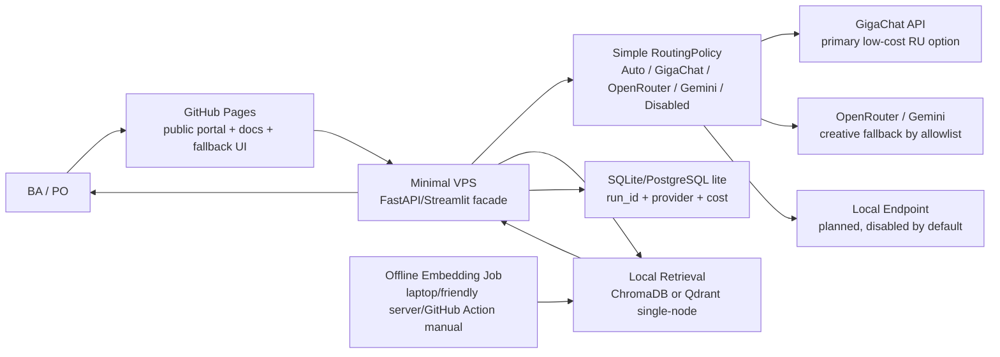
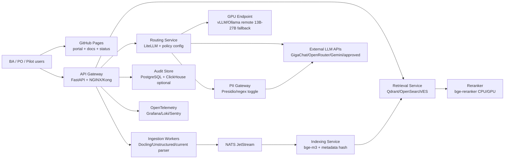

# Research: Synthesis Research — Optimized Architecture Options for Pilot & Production (BL-62)

## Метаданные
- **Дата:** 2026-05-21
- **Версия:** v1
- **Тип документа:** `research`
- **Статус:** Draft -> готов к ревью PO / Tech Lead / Infra
- **Автор:** konard (AI issue solver, по [issue #226](https://github.com/G-Ivan-A/clarify-engine-ai/issues/226))
- **Спринт:** Sprint 6 — Architecture Foundation
- **PR:** [`#227`](https://github.com/G-Ivan-A/clarify-engine-ai/pull/227)
- **Файл:** `docs/research/2026-05-21_bl-62_synthesis-optimized-architectures_v1.md`
- **Линкованный backlog:** [`docs/backlog/2026-05-17_backlog_rag-optimization_v1.5.md`](../backlog/2026-05-17_backlog_rag-optimization_v1.5.md) §0.6, строка `BL-62`
- **Depends on:** `BL-60`, `BL-61`, `BL-58`, `BL-59`
- **Целевая аудитория:** Product Owner, Tech Lead, Infra Lead, BA Lead
- **Ключевые источники в репозитории:**
  - [`docs/research/2026-05-20_bl-60_next-gen-architecture_v1.md`](2026-05-20_bl-60_next-gen-architecture_v1.md)
  - [`docs/research/2026-05-21_bl-61_market-research_v1.md`](2026-05-21_bl-61_market-research_v1.md)
  - [`docs/research/2026-05-21_bl-57_retrieval-architecture_v1.md`](2026-05-21_bl-57_retrieval-architecture_v1.md)
  - [`docs/research/2026-05-20_bl-59_requirement-parsing_v1.md`](2026-05-20_bl-59_requirement-parsing_v1.md)

> **Scope note.** Это исследовательский синтез, не реализация. В рамках PR не меняются `src/`, `configs/`, `prompts/`. Рекомендации ниже должны быть превращены в ADR / BL-задачи после `Accepted` PO / Tech Lead / Infra.

---

## 1. Executive Summary

BL-60 дал архитектурную северную звезду: dynamic LLM routing, production-grade retrieval, микросервисные границы, PII Gateway, observability и три infrastructure tier. BL-61 расширил пространство решений: Elasticsearch не должен быть предположением, каждый компонент обязан иметь заменяемый self-hosted и managed путь, а cheapest-first выбор должен учитывать будущую миграцию. Комментарии PO и команды поддержки добавляют важную коррекцию: MVP должен доказывать ценность AI-assisted analytical workflow, а не демонстрировать локальный inference любой ценой.

Из этого синтеза получаются два реалистичных сценария:

1. **Бюджетно-оптимизированный.** GitHub Pages как независимый frontend/docs layer, минимальный VPS в пределах `<= 2100 руб/мес` для backend + vector storage, offline embeddings, локальный retrieval, external LLM primary, простой configurable routing и planned-but-disabled local endpoint. Это максимум продуктовой ценности при минимальном cash burn. Оценка cash TCO за 12 мес: **~26-36 тыс. руб. без labor**, **10-14 человеко-дней** на подготовку.
2. **Целе-оптимизированный.** Hybrid cloud/on-prem pilot: выделенные сервисные границы, Qdrant/OpenSearch или корпоративный Elasticsearch, NATS, LiteLLM gateway, GPU-enabled endpoint для embeddings/rerank/local fallback, Presidio/PII Gateway как включаемый governance layer, OpenTelemetry и audit analytics. Это максимум качества, latency и scale без перехода в enterprise platform. Оценка cash TCO за 12 мес: **~0.75-1.9 млн руб. без labor**, **25-40 человеко-дней**.

**Recommendation:** стартовать Sprint 6 с бюджетно-оптимизированного сценария как default, но не hardcode-ить его. Реализация должна сразу иметь интерфейсы `SearchBackend`, `LLMProvider`, `RoutingPolicy`, `EmbeddingJob`, `AuditStore`, `PiiGateway`. Тогда переход к целевому варианту станет заменой провайдеров и включением feature flags, а не переписыванием продукта.

**Разрешение конфликта ограничений issue #226.** В задаче одновременно указаны снятие RU-резидентности / runtime PII masking как blockers и Scope Note про NFR-04. В этом документе NFR-04 трактуется как **архитектурная capability и enterprise gate**, а не как MVP blocker: MVP может использовать external-only inference после ручной очистки входных документов, но архитектура сохраняет PII hooks, local-only route и audit trail для будущего включения.

---

## 2. Синтез BL-60 / BL-61 и снятые ограничения

### 2.1. Что берём из BL-60

| Решение BL-60 | Берём? | Причина |
|---------------|--------|---------|
| Rule-based LLM Router для Sprint 6 | Да | Даёт cost/latency control без ML-router complexity; применим в обоих вариантах. |
| Elasticsearch / Qdrant / Chroma split | Да, но без ES-by-default | Production search нужен, но для бюджета достаточно ChromaDB/Qdrant single-node; ES остаётся target/enterprise. |
| Strangler Fig миграция от монолита | Да | Снижает риск distributed monolith; первый шаг — интерфейсы и worker split. |
| PII Gateway | Да, как capability | В бюджетном варианте может быть disabled/manual, но contract point должен существовать. |
| Full microservices topology | Частично | Для MVP достаточно logical boundaries; physical split нужен только в целевом варианте. |

### 2.2. Что берём из BL-61

| Решение BL-61 | Берём? | Причина |
|---------------|--------|---------|
| Replaceable provider contracts | Да | Главный guardrail от vendor lock-in и переписывания ядра. |
| Budget stack: ChromaDB/pgvector, RabbitMQ/Redis, LiteLLM, regex PII | Да | Подходит под `<= 2100 руб/мес`, если не тащить локальный LLM runtime. |
| Optimal stack: Qdrant/OpenSearch, NATS, Docling/Unstructured, bge-m3, vLLM | Да | Основа целевого pilot без enterprise SLA. |
| SaaS only behind budget/security gates | Да | External APIs допустимы, но через explicit allowlist и spend caps. |
| Enterprise stack | Нет для Sprint 6 | Kafka/Pulsar, KServe, Datadog, cloud DLP и multi-tenant governance преждевременны. |

### 2.3. Какие ограничения сняты и что это меняет

| Ограничение | Статус в BL-62 | Архитектурное следствие |
|-------------|----------------|--------------------------|
| Mandatory local LLM inference on VPS | Снято | Не держим 7B/13B модель на слабом VPS; local endpoint остаётся planned capability. |
| Runtime PII masking as MVP blocker | Снято | Ручная очистка и allowlist допускаются; PII Gateway проектируется как future toggle. |
| RU-резидентность как единственный допустимый путь | Снято для research/MVP | Можно использовать OpenRouter/Gemini/другие endpoints, но маршруты помечаются risk class. |
| Elasticsearch as required search backend | Снято | Budget: ChromaDB/Qdrant; Target: Qdrant/OpenSearch/ES по доступности. |
| Full microservices before value proof | Снято | Сначала contracts + worker split; сервисы выделяются после метрик нагрузки. |

### 2.4. Инварианты, которые нельзя ломать

| Инвариант | Почему сохраняется |
|-----------|--------------------|
| `HybridRetriever.retrieve(query, top_k) -> list[Chunk]` | На нём держатся BL-58 experiments и `evaluate_rag.py`. |
| `LLMClient.generate_rag_response(query, contexts) -> str` | UI / Pipeline не должны знать о provider routing. |
| `pipeline.fallback_providers` | Backward-compatible fallback, если новый router выключен. |
| `STRICT_MODE` и citation checks | Guardrail против галлюцинаций, особенно при external inference. |
| `load_requirements_by_extension()` contract | Parser migration не должна ломать export pipeline. |
| GitHub Pages / docs layer | Frontend/docs должны оставаться доступными при падении VPS. |

---

## 3. Вариант 1: Бюджетно-оптимизированный

### 3.1. Назначение

Этот вариант оптимизирует не абсолютное качество inference, а скорость проверки продуктовой гипотезы: умеет ли Clarify Engine помогать BA работать с корпусом требований через RAG, routing и накопление knowledge base. Постоянный VPS используется только для backend, retrieval и хранения индекса; тяжёлые embeddings выполняются offline, а LLM inference уходит во внешние API или remote-friendly endpoint.

### 3.2. Архитектурная схема

### 3.3. Стек

| Layer | Выбор | Обоснование |
|-------|-------|-------------|
| Frontend/docs | GitHub Pages | Независим от VPS, даёт stable presentation layer и fallback docs. |
| Backend | Current monolith facade + FastAPI/Streamlit | Минимум изменений и backward compatibility. |
| Search/vector storage | ChromaDB current или Qdrant Docker | Qdrant предпочтителен при росте фильтров; ChromaDB допустим для fastest MVP. |
| Embeddings | bge-m3 offline batch | Embedding pipeline остаётся asset, но не грузит VPS в runtime. |
| LLM | GigaChat primary, OpenRouter/Gemini fallback, `Disabled` offline mode | Снимает требование локального inference и держит latency/quality выше CPU-only VPS. |
| Routing | Rule-based config, no orchestration UI | Достаточно Settings -> AI Provider и spend/health gates. |
| PII | Manual pre-clean + optional regex hook | Runtime masking не blocker, но hook сохраняется. |
| Audit | SQLite/PostgreSQL append-only lite | Нужны `run_id`, provider, model, latency, token/cost estimate. |
| Ops | systemd/docker compose, daily backup | Укладывается в один VPS и не требует SRE. |

### 3.4. TCO, 12 мес

Оценка cash cost дана для MVP/pilot без labor. Цены нужно перепроверить перед оплатой: публичные тарифы меняются, а GPU / API usage зависит от workload.

| Статья | Оценка | Комментарий |
|--------|-------:|-------------|
| VPS + included NVMe | `1 782 руб/мес` x 12 = `21 384 руб` | Timeweb Cloud MSK 80: 4 vCPU, 8 GB RAM, 80 GB NVMe, 1 Gbit/s; укладывается в `<= 2100 руб/мес`. |
| External LLM minimum | `1 300 руб/12 мес` | GigaChat 2 Lite pack 20M tokens как платный floor; freemium можно использовать только если условия позволяют. |
| Embeddings API contingency | `700 руб/12 мес` | GigaChat embeddings pack 50M tokens, если offline bge-m3 не используется для части batch. |
| Backups / domain / monitoring reserve | `3 000-12 000 руб/год` | Резерв под snapshots/object backup/alerts; можно снизить ручными backups. |
| **TCO cash, 12 мес** | **~26 384-35 384 руб** | В среднем `~2 199-2 949 руб/мес` вместе с API reserve; server+vector storage отдельно остаётся `1 782 руб/мес`. |
| Engineering effort | `10-14 человеко-дней` | Contracts, deployment, docs, smoke/eval, rollback. |

### 3.5. Roadmap миграции

| Этап | Действие | Критерий успеха | Rollback |
|------|----------|-----------------|----------|
| Week 1 / Gate 0 | Зафиксировать provider interfaces в docs/ADR-010 draft без изменения runtime | PO/Tech Lead согласовали `SearchBackend`, `LLMProvider`, `RoutingPolicy` | Оставить текущий монолит без новых interfaces. |
| Week 1 / Gate 1 | Поднять VPS facade и перенести index storage на persistent volume | `smoke на ARM` и локальный smoke проходят, индекс переживает restart | Вернуть запуск на текущий ARM/local workflow. |
| Week 2 / Gate 2 | Добавить offline embedding job + manual reindex runbook | Reindex воспроизводим, model/version/hash фиксируются | Использовать текущий ChromaDB build path. |
| Week 2 / Gate 3 | Включить simple routing modes: Auto, GigaChat, OpenRouter, Gemini, Disabled | Router overhead p95 `<10 ms`, fallback работает | Вернуть `pipeline.fallback_providers` static chain. |
| Week 3 / Gate 4 | Добавить audit-lite и spend caps | Каждый LLM call имеет `run_id`, provider, model, latency, estimated tokens | Отключить audit write через feature flag, оставить logs. |
| Week 3 / Gate 5 | Провести eval и PO review | `evaluate_rag.py` не хуже baseline, BA сценарий проходит end-to-end | Откатить provider routing, оставить docs layer. |

### 3.6. Риски

| ID | Риск | Вероятность | Impact | Mitigation |
|----|------|-------------|--------|------------|
| BL62-B01 | 8 GB RAM мало для Qdrant + backend + batch | Medium | Medium | Offline embeddings вне VPS, swap, Qdrant limits; ChromaDB fallback. |
| BL62-B02 | External free/cheap API нестабилен | High | Medium | GigaChat paid pack, OpenRouter/Gemini allowlist, `Disabled` retrieval-only mode. |
| BL62-B03 | Runtime PII masking выключен и документы не очищены | Medium | High | Manual cleanup checklist, PII preflight regex warning, local-only route planned. |
| BL62-B04 | ChromaDB путь станет migration trap | Medium | Medium | Store raw chunks + embeddings + metadata hash; prefer Qdrant if fits. |
| BL62-B05 | Нет HA, VPS outage останавливает backend | Medium | Low/Medium | GitHub Pages remains available; documented restore from backup. |
| BL62-B06 | Низкая latency недостижима на cheap VPS | Medium | Medium | External inference primary, warm retrieval index, cache top queries. |

### 3.7. Критерии выбора

Выбирать бюджетно-оптимизированный вариант, если:

- нужно уложиться в `<= 2100 руб/мес` на server + vector storage;
- одновременно работают `1-3 БА`, нагрузка `<=15 запросов/мин`;
- основная цель — доказать value RAG/workflow, а не локальный inference;
- PII можно очищать вручную до загрузки или работать на test/sanitized data;
- downtime backend допустим, если docs/frontend остаются доступны;
- команда не готова держать GPU, ES cluster и observability stack.

### 3.8. Минимальная валидация

| Проверка | Метрика / команда | Gate |
|----------|-------------------|------|
| Retrieval quality | `python scripts/evaluate/evaluate_rag.py` | `hit@5` не ниже текущего baseline более чем на 2 pp. |
| ARM smoke | `smoke на ARM` из runbook + UI upload/chat path | Upload, retrieval и export не регрессируют. |
| Router | Synthetic 40-query set | Accuracy `>=0.80`, p95 `<10 ms`. |
| Cost guard | Daily token/cost report | No unbounded external spend; hard cap per provider. |
| Backup restore | Restore index on clean VPS | RTO `<2 часа` для pilot. |

---

## 4. Вариант 2: Целе-оптимизированный

### 4.1. Назначение

Этот вариант оптимизирует quality, latency и scale для production-capable pilot, но не превращает MVP в enterprise AI platform. Он нужен, когда BA workflow уже подтверждён, появляются стабильные пользователи, растёт корпус документов, нужен p95 в секунды, а routing должен учитывать provider health, quota, PII class и class of query.

### 4.2. Архитектурная схема

### 4.3. Стек

| Layer | Выбор | Обоснование |
|-------|-------|-------------|
| Frontend/docs | GitHub Pages + status page | Сохраняет независимый presentation layer. |
| API | FastAPI + NGINX/Kong/APISIX | Gateway даёт auth, rate limits, versioned routes. |
| Search | Qdrant или OpenSearch; ES при наличии corp cluster | Сильный hybrid/filter path без ES lock-in. |
| Bus | NATS JetStream | Меньше ops burden, чем Kafka, достаточно для ingestion/indexing. |
| Parsing | Current parser contract + Docling/Unstructured adapters | Улучшает layout/table extraction без поломки `load_requirements_by_extension()`. |
| Embeddings | bge-m3 primary, benchmark fallback multilingual-e5/Jina | Локальная quality baseline + A/B без reindex surprises. |
| Rerank | FlashRank/MiniLM -> bge-reranker | Поднимает precision на top-k без полной LLM validation. |
| LLM routing | LiteLLM gateway + rule-based policy | Provider budgets, retries, health, explicit model allowlist. |
| Local inference | Remote GPU endpoint vLLM/Ollama, not required on backend node | GPU-enabled without coupling to cheap VPS. |
| PII | Presidio + RU recognizers behind feature flag | Governance can be enabled per tenant/data class. |
| Audit/observability | PostgreSQL + OpenTelemetry/Grafana/Loki/Sentry; ClickHouse optional | Debuggability for pilot and future enterprise readiness. |

### 4.4. TCO, 12 мес

Оценка cash cost без labor. Диапазон намеренно широкий: целевой вариант зависит от того, доступен ли on-prem GPU / Elasticsearch у заказчика и сколько external tokens реально расходуется.

| Статья | Оценка за 12 мес | Комментарий |
|--------|-----------------:|-------------|
| Backend/API/search nodes | `120-360 тыс. руб` | 1-3 nodes, Qdrant/OpenSearch/ES, backups. |
| GPU endpoint / amortization | `420-960 тыс. руб` | 24 GB GPU class for embeddings/rerank/local fallback; can be on-demand or on-prem amortized. |
| External LLM budget | `120-360 тыс. руб` | GigaChat/OpenRouter/Gemini/approved providers with caps. |
| Observability + audit storage | `60-180 тыс. руб` | Grafana/Loki/Sentry/self-host storage; ClickHouse optional. |
| Object storage / backups | `30-90 тыс. руб` | MinIO/RU S3-compatible lifecycle. |
| **TCO cash, 12 мес** | **~750 тыс.-1.9 млн руб** | Без постоянного SRE; включает GPU-enabled path и production pilot reserves. |
| Engineering effort | `25-40 человеко-дней` | Interfaces, workers, routing, eval gates, deployment, rollback docs. |

### 4.5. Roadmap миграции

| Этап | Действие | Критерий успеха | Rollback |
|------|----------|-----------------|----------|
| Week 1 / Gate 0 | ADR-010: target contracts, service boundaries, data ownership | Accepted PO/Tech Lead/Infra | Продолжить budget architecture без service split. |
| Week 1-2 / Gate 1 | Ввести `SearchBackend` и dual-index Chroma -> Qdrant/OpenSearch/ES | `evaluate_rag.py` parity, top-k diffs explainable | Read path remains Chroma, new index deleted/rebuilt. |
| Week 2 / Gate 2 | Выделить ingestion/indexing worker через NATS | Batch indexing не блокирует UI; retries visible | Вернуть sync indexing path. |
| Week 3 / Gate 3 | Включить LiteLLM/routing service in shadow mode | Router decisions logged, but static chain still serves | Disable routing service, use `pipeline.fallback_providers`. |
| Week 3-4 / Gate 4 | Подключить reranker and GPU endpoint for selected classes | p95 target met, precision improves on golden set | Feature flag off for rerank/local GPU. |
| Week 4 / Gate 5 | Включить PII Gateway for high-risk docs only | No external call without mask decision | Fall back to manual cleanup + local-only route. |
| Week 5 / Gate 6 | Observability/audit dashboards and pilot readiness review | Traceable run lifecycle, error budget visible | Keep file logs + PostgreSQL audit only. |

### 4.6. Риски

| ID | Риск | Вероятность | Impact | Mitigation |
|----|------|-------------|--------|------------|
| BL62-T01 | Microservices become distributed monolith | Medium | High | Strangler Fig: physical split only after interface tests and metrics. |
| BL62-T02 | GPU costs exceed value | High | Medium | GPU endpoint only for rerank/local fallback classes; external API remains primary for creative tasks. |
| BL62-T03 | Search migration changes answer quality | Medium | High | Dual-index shadow mode, `evaluate_rag.py`, frozen embedding version/hash. |
| BL62-T04 | Provider routing causes compliance ambiguity | Medium | High | Provider allowlist, data class tags, audit trail, PII Gateway toggle. |
| BL62-T05 | Presidio/RU recognizers produce false confidence | Medium | Medium | Treat masking as risk signal, not proof; manual review for high-risk docs. |
| BL62-T06 | Observability stack consumes ops time | Medium | Medium | Start with OpenTelemetry + Grafana/Loki minimal dashboards, defer AIOps. |
| BL62-T07 | ADR/contract work delays implementation | Low/Medium | Medium | ADR-010 scoped to interfaces, not full enterprise governance. |

### 4.7. Критерии выбора

Выбирать целе-оптимизированный вариант, если:

- BA workflow уже доказал value, и нужно обслуживать `10-25` активных пользователей;
- p95 chat latency должен быть `2-4 сек`, а не `6-15 сек`;
- корпус растёт выше `50k-100k` chunks или нужны сильные metadata filters;
- external API spend становится управляемым через routing, а не ручным выбором;
- появляется on-prem GPU / approved rented GPU / remote self-hosted endpoint;
- нужен audit trail для review, cost attribution и будущего enterprise sales;
- PO готов финансировать `~750 тыс.-1.9 млн руб` cash TCO за 12 мес без labor.

### 4.8. Минимальная валидация

| Проверка | Метрика / команда | Gate |
|----------|-------------------|------|
| Retrieval migration | `python scripts/evaluate/evaluate_rag.py` | `hit@5 >= 0.90`, `MRR >= 0.85` or documented delta. |
| Reranker | Golden set + latency profile | Precision@3 improves, p95 overhead `<=300 ms` for top-20. |
| Router | 200-query synthetic router golden set | Accuracy `>=0.85`, p95 `<10 ms`, savings `>=20%` vs all-to-premium. |
| ARM and pilot smoke | `smoke на ARM` + staging smoke | Current upload/chat/export scenarios unchanged. |
| PII route | High-risk synthetic samples | No external call unless data class allows it. |
| Observability | Trace every request from API to provider | `run_id` joins retrieval, LLM, audit and errors. |

---

## 5. Сравнительная матрица

| Критерий | Бюджетно-оптимизированный | Целе-оптимизированный |
|----------|---------------------------|------------------------|
| Главная цель | Доказать value при минимальном cash burn | Дать production-capable pilot с quality/latency/scale |
| Cash TCO, 12 мес | `~26-36 тыс. руб` без labor | `~750 тыс.-1.9 млн руб` без labor |
| Постоянный server/storage | `1 782 руб/мес` baseline | `10-30 тыс. руб/мес` backend/search/storage + GPU отдельно |
| Пользователи | `1-3 БА` | `10-25 БА` |
| Throughput | `<=15 запросов/мин` | `30-80 запросов/мин` |
| Latency p95 | `6-15 сек` depending provider/cold path | `2-4 сек` with warm retrieval/rerank/GPU |
| Retrieval | ChromaDB/Qdrant single-node | Qdrant/OpenSearch/ES with dual-index migration |
| Embeddings | Offline batch | GPU/CPU service + versioned batch jobs |
| LLM | External primary, local planned disabled | External + GPU local endpoint fallback |
| Routing | Rule-based modes, no orchestration UI | LiteLLM gateway + health/quota/data-class policy |
| PII/governance | Manual cleanup + optional regex warning | PII Gateway feature flag + audit trail |
| Observability | Logs + audit-lite | OpenTelemetry + dashboards + audit store |
| Migration effort | Low | Medium |
| Main risk | Underpowered infra, external API instability | Overengineering and GPU/search ops cost |

**Decision rule:** если в ближайшие 4-6 недель цель — подтвердить продуктовую ценность, выбрать бюджетный вариант. Если уже есть подтверждённый pilot demand, SLA ожидания и бюджет на GPU/search, выбрать целевой вариант или готовить staged переход от бюджетного к целевому.

---

## 6. Best Practices Integration

| Practice | Как применено | Почему не копируем буквально |
|----------|---------------|-------------------------------|
| **NIST AI RMF** | Risk register, data class routing, audit trail, human review gates for high-risk docs | Full governance program преждевременен для MVP; нужен lightweight risk control. |
| **OWASP LLM Top 10** | Prompt-injection / sensitive disclosure / overreliance mitigations: retrieval grounding, provider allowlist, output validation, PII hooks | Enterprise guardrails не должны блокировать early product learning. |
| **Strangler Fig** | Monolith remains default; new services/interfaces grow around it; rollback per stage | Big-bang microservices would add risk before value proof. |
| **FrugalGPT** | Cascade/routing by query class, provider cost, health and quality; cheap/default models before premium/local GPU | ML cascade deferred until enough labeled router data exists. |

---

## 7. Roadmap границ и open-source компоненты

BL-62 расширяет границы будущей архитектуры, но не требует немедленного выделения репозиториев. Компоненты, которые можно развивать отдельно и использовать в текущем проекте:

| Компонент | Возможный open-source artifact | Когда выделять |
|-----------|-------------------------------|----------------|
| RoutingPolicy / provider gateway config | `clarify-llm-router` | После 200+ labeled routing cases и стабильных provider contracts. |
| Retrieval eval harness | `clarify-rag-eval` | Уже почти готов как reusable experiment layer вокруг `evaluate_rag.py`. |
| DocumentBlock parser contract | `clarify-doc-structure` | После BL-59 implementation и 2-3 форматов с golden set. |
| PII preflight recognizers | `clarify-pii-ru` | После юридического review token formats and false positive policy. |
| GitHub Pages research portal | `clarify-docs-portal` | Если research/HTML exports станут внешним review artifact. |
| Audit schema + cost reports | `clarify-ai-audit` | После target pilot, когда появятся реальные provider/cost traces. |

**ADR implication:** создать `ADR-010: Microservices decomposition & provider abstraction`, где зафиксировать logical boundaries, feature flags, backward compatibility, data ownership и migration sequence. ADR не должен требовать немедленного Kubernetes/Kafka/KServe.

---

## 8. Рекомендация и открытые вопросы

### 8.1. Рекомендация

Рекомендуемый старт Sprint 6 — **бюджетно-оптимизированный вариант с целевыми интерфейсами**:

1. Сохранить current monolith contracts.
2. Добавить ADR-010 и provider interfaces before runtime split.
3. Поднять minimal VPS + persistent vector storage.
4. Сделать offline embedding pipeline reproducible.
5. Включить simple routing and spend caps.
6. Провести `evaluate_rag.py`, `smoke на ARM`, backup restore и PO review.

Переходить к целевому варианту только после одного из триггеров:

- `>3` активных BA или `>15 запросов/мин`;
- p95 стабильно выше `8-10 сек` и мешает работе;
- корпус растёт выше `50k chunks` или требуются сложные filters;
- external API cost приближается к стоимости GPU endpoint;
- PO требует audit/compliance evidence для enterprise conversations.

### 8.2. Открытые вопросы

| Вопрос | Нужен от | Влияние |
|--------|----------|---------|
| Какой объём реального корпуса в chunks / GB ожидается в pilot? | PO / BA Lead | ChromaDB vs Qdrant decision, storage sizing. |
| Допустимы ли OpenRouter/Gemini для sanitized docs? | PO / Security | Provider allowlist and PII gate defaults. |
| Есть ли доступный on-prem GPU или friendly remote endpoint? | Infra | Target TCO and local fallback strategy. |
| Требуется ли RU-резидентность уже в pilot или только future enterprise? | PO / Legal | Whether PII Gateway is warning-only or hard blocker. |
| Нужен ли отдельный public docs portal на GitHub Pages в Sprint 6? | PO | Frontend/presentation priority. |

---

## 9. Source Register

Access date for external sources: **2026-05-21**.

| Area | Source | Использование |
|------|--------|---------------|
| VPS pricing | https://timeweb.cloud/services/cloud-servers | Budget VPS baseline: Cloud MSK 80, 4 vCPU / 8 GB / 80 GB / 1 Gbit/s. |
| Cloud pricing caveat | https://yandex.cloud/ru/docs/compute/pricing | Pricing volatility, traffic/storage/resource billing model. |
| GigaChat tariffs | https://developers.sber.ru/docs/ru/gigachat/tariffs/individual-tariffs | Low-cost LLM/token pack and embeddings pack references. |
| OpenRouter pricing | https://openrouter.ai/pricing | External provider marketplace, free/pay-as-you-go model and BYOK/rate-limit caveats. |
| Gemini pricing | https://ai.google.dev/gemini-api/docs/pricing | External fallback pricing model, free/paid tier caveats. |
| NIST AI RMF | https://www.nist.gov/itl/ai-risk-management-framework | Risk management framing and trustworthy AI governance. |
| OWASP LLM Top 10 | https://owasp.org/www-project-top-10-for-large-language-model-applications/ | Security risk framing for prompt injection, data disclosure, overreliance. |
| Strangler Fig | https://martinfowler.com/bliki/StranglerFigApplication.html | Staged migration pattern from monolith to services. |
| FrugalGPT | https://arxiv.org/abs/2305.05176 | Cost/quality cascade strategy for LLM routing. |

---

## 10. DoD checklist (issue #226)

| DoD item | Status | Где |
|----------|:------:|-----|
| Создан документ `docs/research/2026-05-XX_bl-62_synthesis-optimized-architectures_v1.md` | ✅ | Этот файл |
| Два чётких варианта решений с явными компромиссами | ✅ | §3, §4, §5 |
| Каждый вариант включает архитектурную схему | ✅ | §3.2, §4.2 Mermaid |
| Каждый вариант включает TCO-оценку 12 мес. | ✅ | §3.4, §4.4 |
| Каждый вариант включает roadmap миграции, риски, критерии выбора | ✅ | §3.5-§3.7, §4.5-§4.7 |
| Решения обоснованы ссылками на BL-60/BL-61 + best practices | ✅ | §2, §6, §9 |
| Указано, какие ограничения сняты и как это повлияло на архитектуру | ✅ | §1, §2.3 |
| Предложен минимальный план валидации | ✅ | §3.8, §4.8 |
| Документ ревьюирован и `Accepted` PO / Tech Lead / Infra | ⏳ | Ожидает review PR #227 |
| `CHANGELOG.md` обновлён | ✅ | `RESEARCH: BL-62 synthesis of optimized architecture options (budget vs target)` |
| Backlog v1.5 §0.6: строка `BL-62` -> `✅ Closed` со ссылкой на PR | ✅ | [`docs/backlog/2026-05-17_backlog_rag-optimization_v1.5.md`](../backlog/2026-05-17_backlog_rag-optimization_v1.5.md) |

---

*— BL-62 Research draft, 2026-05-21. konard (AI issue solver) by issue [#226](https://github.com/G-Ivan-A/clarify-engine-ai/issues/226).*
